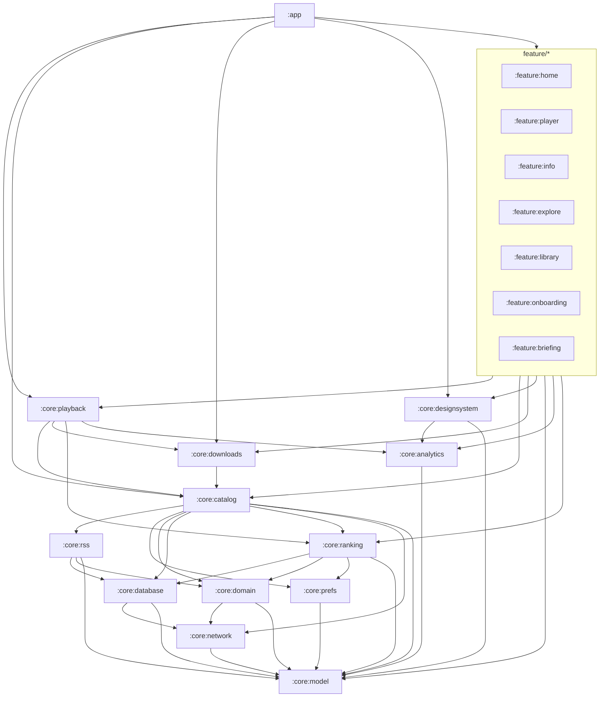

# Boxlore architecture

Cross-module map for the Android app. Module-local detail lives in each module’s `README.md` (see `docs/MODULE_README_TEMPLATE.md`).

## Product invariants

- **`applicationId`** stays `cx.aswin.boxlore` (do not change for package renames).
- **Code packages / namespaces** are `cx.aswin.boxlore.*` (renamed from `cx.aswin.boxcast.*`). Phase 2 aligns package roots with Gradle modules. SharedPreferences **file** names migrate `boxcast_*` → `boxlore_*` via dual-read `PrefsFileMigrator` (PR8); **key** strings inside those files and DataStore `user_preferences` stay unchanged.
- WorkManager: `LegacyWorkerFactory` is a **permanent** upgrade bridge for pre-rename worker FQCNs (do not delete without verified zero legacy work).
- Deep links: accept **`boxlore://` + `boxcast://`** (and both https share path prefixes) forever.
- BuildConfig API keys: prefer `BOXLORE_*` local.properties / BuildConfig fields; Gradle dual-reads `BOXCAST_*` fallbacks.
- **One UI `PlaybackRepository`** — never recreate per route or worker.
- **Construction order** for shared graph: DB → `PodcastRepository` → `QueueRepository` → `PlaybackRepository` → `QueueManager` → `SmartDownloadManager`.
- Smart Queue auto-refill is **service-owned only** (`BoxLorePlaybackService`).
- Do not rename: DataStore `user_preferences`, Room DB filename, `rss:` / negative IDs, mediaId prefixes, `customCacheKey`.

## Current Gradle modules

```text
:app
:core:model | :core:network | :core:domain | :core:database | :core:prefs
:core:analytics | :core:catalog | :core:rss | :core:downloads | :core:playback | :core:ranking
:core:designsystem | :core:testing
:feature:home | :feature:player | :feature:info | :feature:explore
:feature:library | :feature:onboarding | :feature:briefing
```

Folder path equals Gradle id (`core/playback` → `:core:playback`).

### Gradle module id = Java/Kotlin package (Phase 2)

**Policy (Phase 2 Final):** Kotlin/Java package roots **must match** Gradle module ids (e.g. `:core:playback` → `cx.aswin.boxlore.core.playback`). The old A8 “Gradle id ≠ package is permanent” policy is **retired**.

Package alignment is complete for all extracted cores (`prefs`, `analytics`, `rss`, `ranking`, `downloads`, `playback`, `database`, `catalog`) with upgrade failsafes (`LegacyWorkerFactory` + old-FQCN stubs under `core.data.*`, dual ProGuard, `PrefsFileMigrator`). See [`docs/PACKAGE_MIGRATION_MAP.md`](docs/PACKAGE_MIGRATION_MAP.md).

| Module | Owns |
| :--- | :--- |
| `:core:network` | Extracted API client (`BoxLoreApi` / `NetworkModule`) + network DTOs |
| `:core:domain` | Thin ports + `RssSubscriptionResult` (no Room / repos) |
| `:core:database` | Main Room (`BoxLoreDatabase`, entities, DAOs, migrations) |
| `:core:prefs` | `UserPreferencesRepository` + `BoxcastPrefs` (`boxlore_prefs` via `PrefsFileMigrator`) |
| `:core:analytics` | Analytics event capture façade (`AnalyticsHelper`, `Analytics` interface, `RecordingAnalytics`, `ErrorReporter`); PostHog SDK init stays in `:app`; features must not import PostHog; package `cx.aswin.boxlore.core.analytics` |
| `:core:catalog` | **Catalog/orchestration only** — `PodcastRepository`, `SubscriptionRepository`, content sections, backup/restore, `SharedAppDependencies` bridge; **Phase 2 target** `cx.aswin.boxlore.core.catalog` (transitional `core.data.*` until PR10); re-exports `:core:rss` via `api`; ranking is `implementation` (consumers declare `:core:ranking`); does **not** re-export analytics |
| `:core:rss` | RSS feed fetch/parse, `RssPodcastRepository`, `RssIdGenerator` (`rss:` prefix + negative episode IDs), `RssSourceMatcher`, `DownloadCacheRelinker` port; package `cx.aswin.boxlore.core.rss` |
| `:core:ranking` | Adaptive candidate scoring (`AdaptiveCandidateScorer`), LinUCB model, Bayesian facets, diversity re-ranking, feedback loop, own `AdaptiveRankingDatabase`; implements `RankingResetPort`; package `cx.aswin.boxlore.core.ranking` |
| `:core:downloads` | `DownloadRepository`, `SmartDownloadManager`, WorkManager workers under `cx.aswin.boxlore.core.downloads` (+ permanent `core.data` stubs) |
| `:core:playback` | `PlaybackRepository`, queue, Media3 services, smart-queue helpers (`SmartQueueEngine`, `QueueMath`, `MixtapeEngine`, …) |

### Dependency direction



Primary stack: **playback → catalog → prefs / domain / database / network / model**.

Rules:

- No feature → feature Gradle dependencies.
- `:core:playback` → `:core:catalog` (not the reverse).
- `:core:catalog` must **not** depend on `:core:designsystem` (share UI lives in designsystem; seek notification icons live in catalog res).
- Features that need analytics or ranking declare `:core:analytics` / `:core:ranking` directly (catalog does not re-export analytics; ranking is not an `api` edge).
- Zero feature-module `PostHog.capture` / `import com.posthog` — guarded by `scripts/ci/check-feature-no-posthog.sh`.
- Domain enums used by both catalog and UI (e.g. `AutoTranscriptState`) belong in `:core:model`.
- `:core:domain` holds ports only (`model` + `network` for `HistoryItem`); `:core:catalog` implements them and re-exports via `api`.
- `:core:network` is the extracted HTTP/API module; `RssFeedClient` lives in `:core:rss` (Phase 2 target package `cx.aswin.boxlore.core.rss`; transitional `core.data` until PR8; re-exported via `:core:catalog → api(rss)`).
- `:core:database` owns main Room (`BoxLoreDatabase`); Phase 2 target `cx.aswin.boxlore.core.database` (PR9); Room **filenames/tables unchanged**.
- `:core:prefs` owns DataStore + prefs façades; Phase 2 target `cx.aswin.boxlore.core.prefs` + `boxcast_*`→`boxlore_*` file migration (PR8).
- Playback/service Phase 2 target `cx.aswin.boxlore.core.playback` (PR9); keep `LegacyWorkerFactory` + old-FQCN stubs.

## Composition root (today)

There is no Hilt/Koin. `AppContainer` (app module) owns the shared graph and is **created/installed only in `BoxLoreApplication`**. `MainActivity`, `BoxLoreNavHost`, and feature assemblers **consume** `application.container` — they do not construct repositories or a parallel graph.

Home / Settings / Info construct VMs via assemblers (`HomeViewModelAssembler`, `SettingsViewModelAssembler`, `InfoViewModelAssembler`). Narrow ports under `core.domain.ports` (`RssSubscriptionPort`, `RankingResetPort`, `PodcastCatalogPort`, `HistoryRecommendationSource`, `LocalCatalogPort`, `EpisodeOfflineLookupPort`) exist so hard ViewModels and workers can take fakes without full repositories / `BoxLoreDatabase`. Production: `RoomLocalCatalog` / `RoomEpisodeOfflineLookup` from `AppContainer`. `ListeningHistoryBackupPort` remains in `core.data.ports` (Room entity types; avoids domain → database).

## Notable surfaces

| Surface | Module | Notes |
| :--- | :--- | :--- |
| Home + Settings hub + Add RSS | `:feature:home` | Settings includes RSS dialog |
| Learn / LearnHistory (bottom nav) | `:feature:explore` | Learn is a tab, not Explore-only |
| Player overlay | `:feature:player` | `PlayerSheetScaffold` — not a NavHost route |
| Podcast / Episode info | `:feature:info` | Dual episode routes + deep links |
| Playback / queue / Media3 services | `:core:playback` | Phase 2 package `core.playback` (PR9); transitional FQCNs under `core.data.service` until then |
| Learn UI cards | `:feature:explore` | `LearnCuriosityCard` — network `DailyCuriosityDto` only at mapper boundary |
| Home history UI | `:feature:home` | `HomeListeningHistoryItem` / `DebugHistoryItem` — Room history entity only at mapper boundary |
| Info resume progress | `:feature:info` | `InfoListeningProgressItem` — Room history entity only at mapper boundary |
| Android Auto browse | `:core:playback` | `AutoBrowseLibraryCallback` + host; intro/outro via `PlaybackIntroOutroController`; refill via `SmartQueueRefillCoordinator` |
| HTTP API client + DTOs | `:core:network` | `NetworkModule` / `BoxLoreApi`; not RSS |
| Ranking / adaptive scoring | `:core:ranking` | Own `AdaptiveRankingDatabase`; prefer inject/façade over `getInstance` for tests |
| RSS catalog | `:core:rss` `RssPodcastRepository` | Live path; negative / `rss:` IDs; re-exported through `:core:catalog → api(rss)` |

## Module split status

Extracted and live: `:core:playback`, `:core:domain`, `:core:database`, `:core:network`, `:core:prefs`, `:core:downloads`, `:core:analytics`, `:core:ranking`, `:core:rss`, plus `feature/*` and `:core:testing` / `:core:designsystem` / `:core:model`.

`:core:catalog` is **catalog/orchestration only** (not a junk drawer). Gradle id `:core:catalog`; package root `cx.aswin.boxlore.core.catalog`. New modules must ship a comprehensive folder `README.md` in the same change (see `docs/MODULE_README_TEMPLATE.md`).

**Program history:** [`docs/PLAN_MODULAR_ANDROID_HARDENING.md`](docs/PLAN_MODULAR_ANDROID_HARDENING.md) (A0–A8 / B0–B10 scaffold complete).

## Testing layers

| Layer | Purpose |
| :--- | :--- |
| JVM unit (`src/test`) | Pure logic, repos with fakes, ViewModel state |
| Compose UI (`androidTest`) | Controls, nav wiring, `testTag`s |
| Maestro E2E | Real-device flows (`smoke_launch` + `smoke_home_visible` strict on `home_settings_button`) |
| Screenshots (optional) | Visual regression baselines — **P26 incomplete** (no goldens / no Roborazzi) |
| Architecture script | `scripts/ci/check-feature-no-boxlore-database.sh` (Home/Info VMs); `scripts/ci/check-feature-no-posthog.sh` |
| Architecture-as-code | Konsist / filesystem guards in `:core:testing` (`ArchitectureGuardTest`) |

No MockK / Hilt unless the plan is amended. Shared fixtures belong in `:core:testing`.

## Related docs

- `docs/MODULE_README_TEMPLATE.md` — per-module README skeleton
- `docs/ANALYTICS_PRODUCT_INSIGHT.md` / `docs/ANALYTICS_EVENT_MAP.md` / `docs/ANALYTICS_EVENT_GLOSSARY.md` — Phase 2 analytics contracts
- `feature/player/README.md` — player UI structure
- `docs/recommendation-system.md` — ranking/recommendation detail
