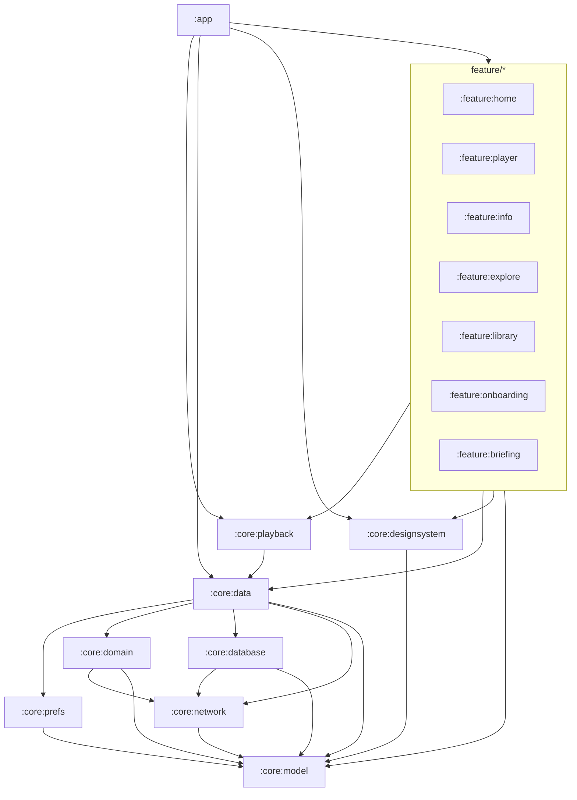

# Boxlore architecture

Cross-module map for the Android app. Module-local detail lives in each module’s `README.md` (see `docs/MODULE_README_TEMPLATE.md`).

## Product invariants

- **`applicationId`** stays `cx.aswin.boxlore` (do not change for package renames).
- **Code packages / namespaces** are `cx.aswin.boxlore.*` (renamed from `cx.aswin.boxcast.*`). SharedPreferences keys such as `boxcast_prefs` and DataStore `user_preferences` stay unchanged for persistence.
- WorkManager: `LegacyWorkerFactory` aliases pre-rename worker FQCNs for one release.
- **One UI `PlaybackRepository`** — never recreate per route or worker.
- **Construction order** for shared graph: DB → `PodcastRepository` → `QueueRepository` → `PlaybackRepository` → `QueueManager` → `SmartDownloadManager`.
- Smart Queue auto-refill is **service-owned only** (`BoxLorePlaybackService`).
- Do not rename: DataStore `user_preferences`, Room DB filename, `rss:` / negative IDs, mediaId prefixes, `customCacheKey`.

## Current Gradle modules

```text
:app
:core:model | :core:network | :core:domain | :core:database | :core:prefs
:core:data | :core:playback
:core:designsystem | :core:testing
:feature:home | :feature:player | :feature:info | :feature:explore
:feature:library | :feature:onboarding | :feature:briefing
```

Folder path equals Gradle id (`core/playback` → `:core:playback`).

| Module | Owns |
| :--- | :--- |
| `:core:network` | Extracted API client (`BoxLoreApi` / `NetworkModule`) + network DTOs |
| `:core:domain` | Thin ports + `RssSubscriptionResult` (no Room / repos) |
| `:core:database` | Main Room (`BoxLoreDatabase`, entities, DAOs, migrations) |
| `:core:prefs` | `UserPreferencesRepository` + `BoxcastPrefs` (`boxcast_prefs` façade) |
| `:core:data` | Repositories, ranking, RSS (`RssFeedClient`), downloads/workers, analytics |
| `:core:playback` | `PlaybackRepository`, queue, Media3 services |

### Dependency direction



Primary stack: **playback → data → prefs / domain / database / network / model**.

Rules:

- No feature → feature Gradle dependencies.
- `:core:playback` → `:core:data` (not the reverse).
- `:core:data` must **not** depend on `:core:designsystem` (share UI lives in designsystem; seek notification icons live in data res).
- Domain enums used by both data and UI (e.g. `AutoTranscriptState`) belong in `:core:model`.
- `:core:domain` holds ports only (`model` + `network` for `HistoryItem`); `:core:data` implements them and re-exports via `api`.
- `:core:network` is the extracted HTTP/API module; `RssFeedClient` stays in `:core:data`.
- `:core:database` owns main Room (`BoxLoreDatabase`); packages remain `cx.aswin.boxlore.core.data.database`.
- `:core:prefs` owns DataStore + `boxcast_prefs` façades; packages remain `cx.aswin.boxlore.core.data`.
- Playback/service packages remain `cx.aswin.boxlore.core.data.*` even though sources live in `:core:playback`.

## Composition root (today)

There is no Hilt/Koin. `AppContainer` (app module) owns the shared graph and is wired from `BoxLoreApplication` / `MainActivity` into feature ViewModels.

Home / Settings / Info construct VMs via assemblers (`HomeViewModelAssembler`, `SettingsViewModelAssembler`, `InfoViewModelAssembler`). Narrow ports under `core.domain.ports` (`RssSubscriptionPort`, `RankingResetPort`, `PodcastCatalogPort`, `HistoryRecommendationSource`) exist so hard ViewModels and workers can take fakes without full repositories. `ListeningHistoryBackupPort` remains in `core.data.ports` (Room entity types; avoids domain → database).

## Notable surfaces

| Surface | Module | Notes |
| :--- | :--- | :--- |
| Home + Settings hub + Add RSS | `:feature:home` | Settings includes RSS dialog |
| Learn / LearnHistory (bottom nav) | `:feature:explore` | Learn is a tab, not Explore-only |
| Player overlay | `:feature:player` | `PlayerSheetScaffold` — not a NavHost route |
| Podcast / Episode info | `:feature:info` | Dual episode routes + deep links |
| Playback / queue / Media3 services | `:core:playback` | FQCNs stay under `core.data.service` |
| HTTP API client + DTOs | `:core:network` | `NetworkModule` / `BoxLoreApi`; not RSS |
| Ranking / adaptive scoring | `:core:data` `ranking/` | Prefer inject/façade over `getInstance` for tests |
| RSS catalog | `:core:data` `RssPodcastRepository` | Live path; negative / `rss:` IDs |

## Target module split

End state for the fat `:core:data` monolith (modular when needed — no junk-drawer modules):

```text
core/{model,network,domain,designsystem,database,prefs,analytics,ranking,rss?,downloads,playback,catalog,testing}
```

Plus existing `feature/*`. New modules must ship a comprehensive folder `README.md` in the same change that creates them (see `docs/MODULE_README_TEMPLATE.md`).

**Program plan:** [`docs/PLAN_MODULAR_ANDROID_HARDENING.md`](docs/PLAN_MODULAR_ANDROID_HARDENING.md) — DI hygiene, remaining extracts (prefs/downloads/analytics/ranking/catalog), MainActivity shrink, test automation, and README exit criteria.

Today: `:core:playback`, `:core:domain`, `:core:database`, `:core:network`, and `:core:prefs` are extracted; downloads/analytics/ranking/RSS still live primarily in `:core:data`.

## Testing layers

| Layer | Purpose |
| :--- | :--- |
| JVM unit (`src/test`) | Pure logic, repos with fakes, ViewModel state |
| Compose UI (`androidTest`) | Controls, nav wiring, `testTag`s |
| Maestro E2E | Real-device flows |
| Screenshots (optional) | Visual regression baselines |

No MockK / Hilt unless the plan is amended. Shared fixtures belong in `:core:testing` once created.

## Related docs

- `docs/MODULE_README_TEMPLATE.md` — per-module README skeleton
- `feature/player/README.md` — player UI structure
- `docs/recommendation-system.md` — ranking/recommendation detail
