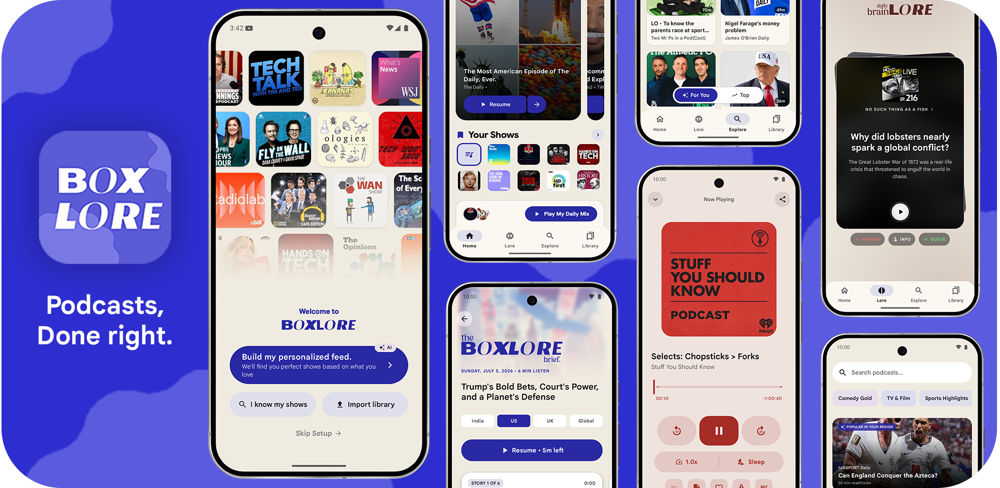
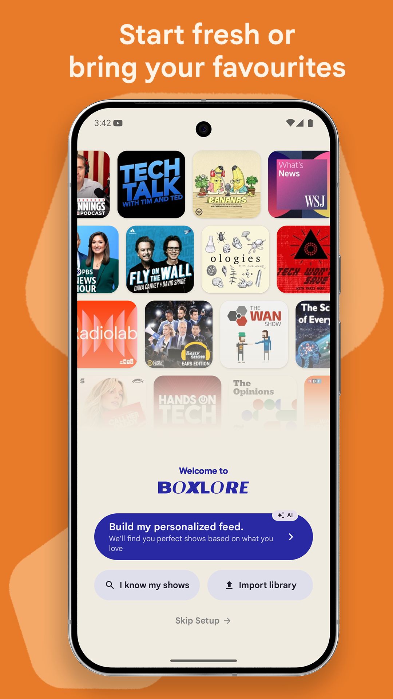
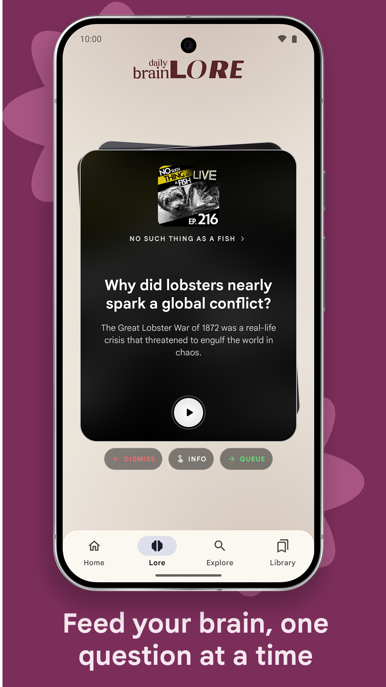
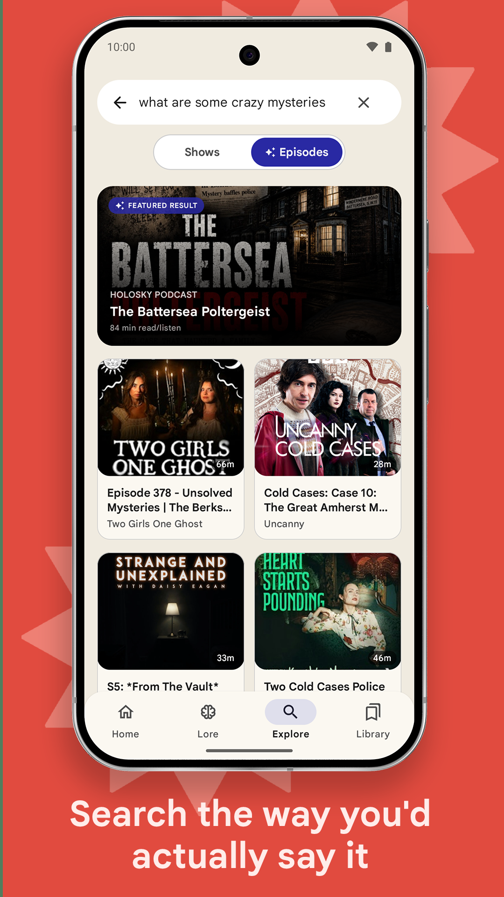
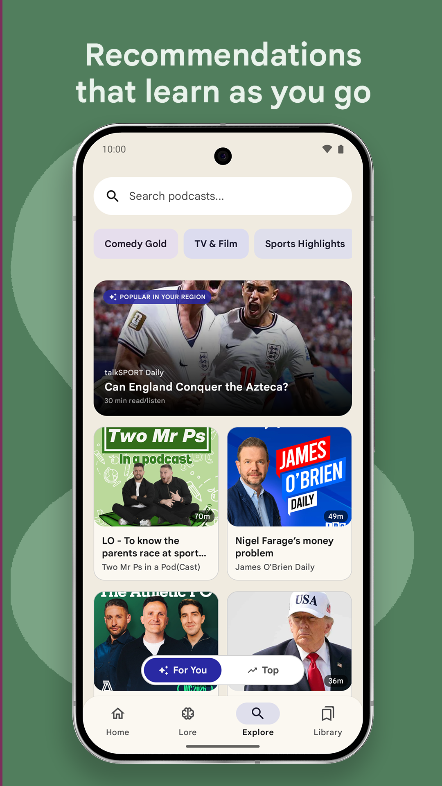
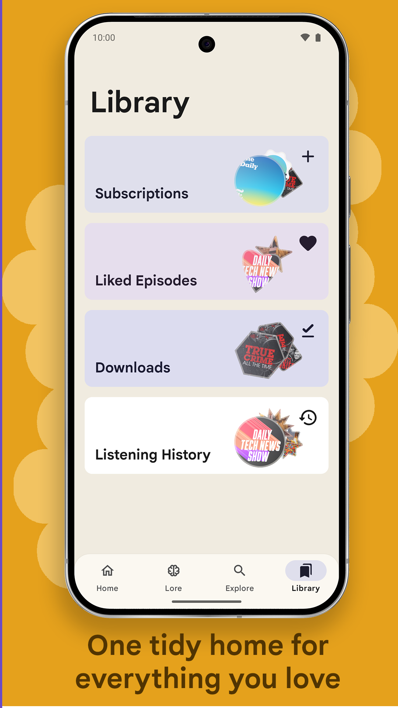
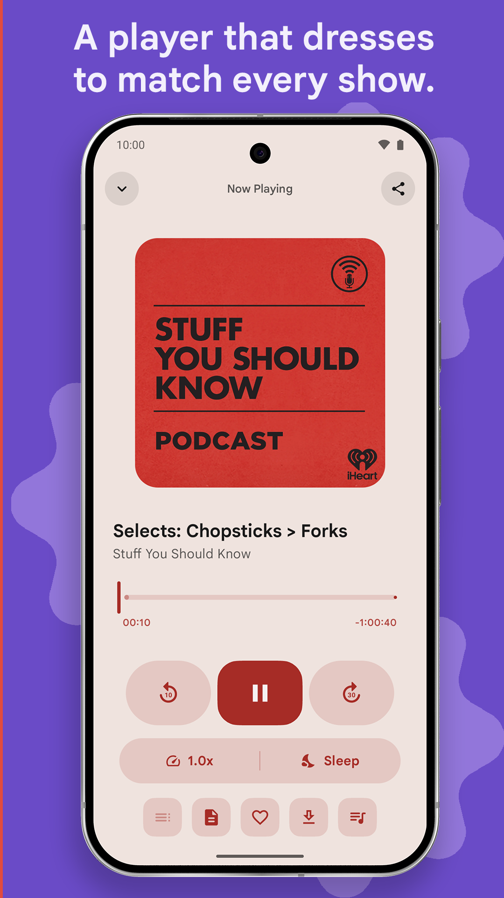

<div align="center">

<!-- Featured project banner -->


### *The Ultimate Podcast App For Android*
*Built completely with Jetpack Compose featuring a beautiful Material 3 Design.*

<br/>

<!-- Real, functional download release APK badge -->
<a href="https://github.com/ashwkun/box.lore.android/releases/latest/download/app-release.apk">
  
</a>

<br/><br/>

<!-- Unified clean tech-stack badges with Simple Icons -->


<br/>

<!-- Real-time development status badges -->


</div>

---

## 📱 About & Architecture

boxlore is a modern, open-source podcast client built from the ground up to showcase Jetpack Compose's full styling and interactive potential.

*   **Dynamic Accent Extraction**: Intercepts album cover artwork, resolves visually dominant colors via the Android Palette API, boosts saturation (min 40%), and bounds lightness (25%–55%) for clean, rich ambient gradients.
*   **Performance Optimizations**: Utilizes deferred rendering of heavy below-the-fold list components during tab slides to preserve a locked 60fps refresh rate on navigation.
*   **Vector Search & Recommendations**: Combines a local SQLite FTS5 index for fast offline queries with a Qdrant Cloud vector embedding space to serve semantic recommendations.

---

## ✨ Features and Interface

<!-- Grid showing real screenshots of the app UI as feature cards -->
<div align="center">
<table>
  <tr>
    <td align="center" width="25%">
      <b>Onboarding</b><br/><br/>
      
    </td>
    <td align="center" width="25%">
      <b>Homescreen</b><br/><br/>
      
    </td>
    <td align="center" width="25%">
      <b>Daily Briefing</b><br/><br/>
      
    </td>
    <td align="center" width="25%">
      <b>Curiosity Cards</b><br/><br/>
      
    </td>
  </tr>
  <tr>
    <td align="center">
      <b>Semantic Search</b><br/><br/>
      
    </td>
    <td align="center">
      <b>Recommendation</b><br/><br/>
      
    </td>
    <td align="center">
      <b>Library</b><br/><br/>
      
    </td>
    <td align="center">
      <b>Player</b><br/><br/>
      
    </td>
  </tr>
</table>
</div>

---

## ✨ Feature Grid

| Section | Highlights & Capabilities |
| :--- | :--- |
| 🏠 **Home Feed** | **Mixtape Curation**: Dynamic, personalized listening queues.<br>**Deferred Composition**: Ultra-smooth 60fps transitions.<br>**Curated Time Blocks**: Adaptive choices matching the time of day. |
| 🎵 **Player** | **Dynamic Ambient Glow**: Real-time HSL color extraction from cover art.<br>**Variable Speed**: 0.5x to 3x with pitch correction.<br>**Buffered Wavy Loader**: Circular wavy loader for loading states. |
| 🔍 **Search & Explore** | **Personalized "For You"**: Interest-based recommendations.<br>**Edge Spelling Checker**: Real-time correction on Cloudflare Edge.<br>**Hybrid Querying**: Fast SQLite + Podcast Index API. |
| 🎬 **Podcasting 2.0** | **Live Transcripts**: Synced reading with jump-to-time audio seeking.<br>**Seekbar Chapters**: Clickable chapter notches.<br>**16:9 Video Podcasts**: Orientation-locked video layouts. |
| ⬇️ **Library & Offline** | **Collapsible Downloads**: Organized list, multi-select operations.<br>**Smart Downloads**: Automated background download purging. |

---

## 🛠️ Codebase Structure

<details>
<summary><b>📦 Core Infrastructure Modules</b></summary>
<br/>

*   **`:core:data`**: Contains repository layer implementations (`PodcastRepository`, `PlaybackRepository`, `DownloadRepository`) and unified mappers.
*   **`:core:designsystem`**: The central foundation for themes, typography, custom expressive shapes, and shared UI composables.
*   **`:core:model`**: Pure Kotlin data classes representing the domain layers (`Episode`, `Podcast`, `Transcript`).
*   **`:core:network`**: Interacts with the remote Podcast Index API and manages requests to edge proxies.
</details>

<details>
<summary><b>🎨 Feature Modules</b></summary>
<br/>

*   **`:feature:explore`**: Powers the curiosity cards stack and recommendation feeds.
*   **`:feature:home`**: Builds the mixtape queue page, time-block updates, and dynamic charts.
*   **`:feature:player`**: Implements the variable-speed audio player, synced text scrolling sheets, and seekbar notch overlays.
*   **`:feature:info`**: Houses detail pages for episodes and podcast shows.
</details>

---

## 🛠️ Tech Stack

### **Core Technologies**

| Technology | Purpose |
|-----------|---------|
| **Kotlin** | 100% Kotlin codebase for type-safe, concise code |
| **Jetpack Compose** | Modern declarative UI framework with Material 3 Expressive |
| **Clean Architecture** | Predictable state management |
| **Coroutines & Flow** | Asynchronous programming and reactive streams |

### **Networking & Database**

| Component | Usage |
|---------|-------|
| **Retrofit 2** | REST API client |
| **Room** | Local database for user history and library |
| **Cloudflare Workers** | Backend proxy (TypeScript) handling remote queries |
| **Turso (libSQL)** | Distributed edge database storing chart rankings |

### **Media & Playback**

| Component | Description |
|-----------|-------------|
| **ExoPlayer (Media3)** | High performance audio playback for podcasts |
| **MediaSession** | System-level playback controls and background service |
| **Coil** | Image loading with caching and color extraction |

---

## 🌐 Data Sources

This app aggregates data from multiple public sources to provide a unified podcast experience:

| Source | Data Provided |
|--------|---------------|
| **Podcast Index API** | Global catalog of podcasts, episodes, and search results |
| **Apple Podcast Charts** | Daily scraped trending feeds via GitHub Actions |

---

## 🚀 Getting Started

### **Download & Install**

1. Download the latest APK from [Releases](../../releases) or click the **Download APK** badge above
2. Enable "Install from Unknown Sources" in Android settings
3. Install and enjoy! 🎙️

### **Build from Source**

```bash
# Clone the repository
git clone https://github.com/ashwkun/box.lore.android.git
cd box.lore.android

# Build the APK
./gradlew assembleDebug

# Install to connected device
./gradlew installDebug
```

**Requirements:**
- Android Studio Ladybug or later
- Android SDK 35+
- JDK 17
- Kotlin 1.9+

---

## 🤝 Contributing

This is a personal passion project, but contributions are welcome! Here's how you can help:

1. **Report Bugs** — Open an issue with detailed reproduction steps
2. **Suggest Features** — Share your ideas in the Discussions tab
3. **Submit PRs** — Fork, code, and submit pull requests

---

## 📄 License

This project is licensed under the **GNU General Public License v3.0** — see the [LICENSE](LICENSE) file for details.

**Key Terms:**
- ✅ You may use, modify, and distribute this software
- ✅ Any derivative work **must also be open source** under GPL v3
- ✅ You must disclose the source code of any modifications
- ⚠️ No warranty is provided

---

## 📊 Repository Dashboard

<div align="center">


<!-- Contribution Activity graph -->


</div>

---

## 👥 Contributors

<div align="center">
  <a href="https://github.com/ashwkun/box.lore.android/graphs/contributors">
    
  </a>
</div>

---

<div align="center">

### Made with ❤️ and ☕ by a Podcast fan

**If you love podcasts and this app, give it a ⭐ on GitHub!**

[⬆ Back to Top](#changelog)

</div>
