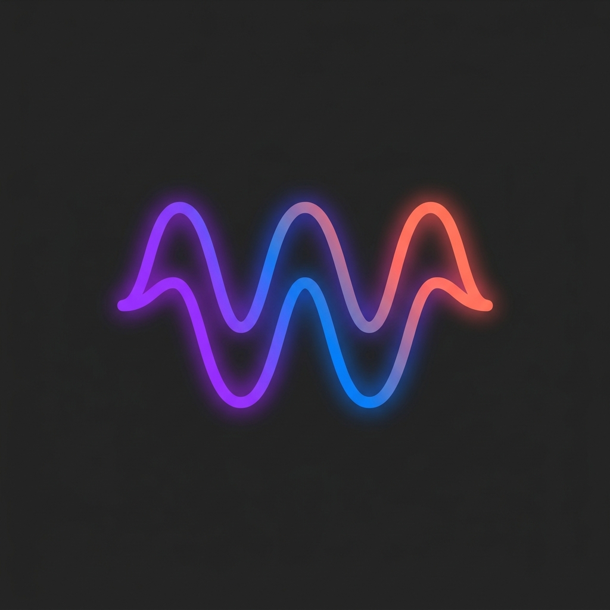

<div align="center">



### *The Ultimate Podcast App For Android*

*Built completely with Jetpack Compose featuring a beautiful Material 3 Design.*
*Download the APK below and start listening!*

[](https://github.com/ashwkun/box.lore.android/releases/latest/download/boxlore-release.apk)

[](https://www.gnu.org/licenses/gpl-3.0)
[](https://www.android.com/)
[](https://kotlinlang.org/)
[](https://developer.android.com/jetpack/compose)
[](https://www.reddit.com/user/Altruistic_Plenty696)

*Because antigravity is free and I love podcasts* 🎙️

---

### 100% built by

<table>
  <tr>
    <td align="center"><br/><sub><b></b></sub></td>
    <td align="center"><br/><sub><b></b></sub></td>
    <td align="center"><br/><sub><b></b></sub></td>
  </tr>
</table>

</div>

---

## 📱 About

BoxCast is an open-source podcast companion app designed to bring all your listening needs into a single, beautiful interface.

Tired of clunky audio players, rigid grids, and missing out on trending shows? **BoxCast simplifies it all.**

- **Material 3 Expressive Design System** with custom podcast theming
- **M3 Dynamic Theming** that extracts colors from album art in real-time
- **Spring-based motion physics** for natural UI interactions
- **Variable typography** integration for clean, adaptable reading
- **Expressive Shapes** for beautiful avatars and backgrounds
- Buttery smooth gestures and edge-to-edge scaling animations
- Responsive staggered and mosaic grids that adapt dynamically

---

## ✨ Features

### 🏠 **Home — Your Podcast Hub**
- **Hero Carousel**: Spotlight trending podcasts with full-bleed artwork
- **Curated Time Blocks**: Picks that adapt to your time of day
- **Your Shows**: New episodes from subscriptions
- **Resume Playback**: Resume listening instantly

### 🎵 **Player — Beautiful Playback**
- **Dynamic Theming**: Album art colors are extracted in real-time
- **Variable Speed**: 0.5× to 3× with pitch correction
- **Queue & Up Next**: Drag-to-reorder queue
- **Sleep Timer**: Preset durations with a fade-out

### 🔍 **Explore & Search**
- **Genre Browsing**: Filter trending charts by category
- **Hybrid Search**: Local edge database matching + full Podcast Index catalog
- **Region Support**: Browse charts by localized countries

### 📚 **Library & Offline**
- **Offline Downloads**: Save episodes with background downloading
- **Listening History**: Full playback history with resume positions natively synced
- **Liked Episodes**: Quick-access list of hearted content

---

## 📸 Screenshots

<div align="center">

<table>
  <tr>
    <td></td>
    <td></td>
    <td></td>
  </tr>
</table>


<table>
  <tr>
    <td></td>
    <td></td>
  </tr>
</table>

</div>

---

## 🛠️ Tech Stack

### **Core Technologies**

| Technology | Purpose |
|-----------|---------|
| **Kotlin** | 100% Kotlin codebase for type-safe, concise code |
| **Jetpack Compose** | Modern declarative UI framework with Material 3 Expressive |
| **Clean Architecture** | Predictable state management |
| **Coroutines & Flow** | Asynchronous programming and reactive streams |

### **Networking & Database**

| Component | Usage |
|---------|-------|
| **Retrofit 2** | REST API client |
| **Room** | Local database for user history and library |
| **Cloudflare Workers** | Backend proxy (TypeScript) handling remote queries |
| **Turso (libSQL)** | Distributed edge database storing chart rankings |

### **Media & Playback**

| Component | Description |
|-----------|-------------|
| **ExoPlayer (Media3)** | High performance audio playback for podcasts |
| **MediaSession** | System-level playback controls and background service |
| **Coil** | Image loading with caching and color extraction |

---

## 🌐 Data Sources

This app aggregates data from multiple public sources to provide a unified podcast experience:

| Source | Data Provided |
|--------|---------------|
| **Podcast Index API** | Global catalog of podcasts, episodes, and search results |
| **Apple Podcast Charts** | Daily scraped trending feeds via GitHub Actions |

---

## 🚀 Getting Started

### **Download & Install**

1. Download the latest APK from [Releases](../../releases) or click the **Download APK** badge above
2. Enable "Install from Unknown Sources" in Android settings
3. Install and enjoy! 🎙️

### **Build from Source**

```bash
# Clone the repository
git clone https://github.com/ashwkun/box.lore.android.git
cd box.lore.android

# Build the APK
./gradlew assembleDebug

# Install to connected device
./gradlew installDebug
```

**Requirements:**
- Android Studio Ladybug or later
- Android SDK 35+
- JDK 17
- Kotlin 1.9+

---

## 🤝 Contributing

This is a personal passion project, but contributions are welcome! Here's how you can help:

1. **Report Bugs** — Open an issue with detailed reproduction steps
2. **Suggest Features** — Share your ideas in the Discussions tab
3. **Submit PRs** — Fork, code, and submit pull requests

---

## 📄 License

This project is licensed under the **GNU General Public License v3.0** — see the [LICENSE](LICENSE) file for details.

**Key Terms:**
- ✅ You may use, modify, and distribute this software
- ✅ Any derivative work **must also be open source** under GPL v3
- ✅ You must disclose the source code of any modifications
- ⚠️ No warranty is provided

---

<div align="center">

### Made with ❤️ and ☕ by a Podcast fan

**If you love podcasts and this app, give it a ⭐ on GitHub!**

[⬆ Back to Top](#%EF%B8%8F-boxcast)

</div>
