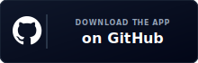

<div align="center" id="top">


### A podcast app that actually gets personal

*Proprietary. All Rights Reserved. No ads. Ever.*

<br/>
<br/>
<div align="center">
  <a href="https://github.com/ashwkun/boxlore/releases/latest/download/app-release.apk">
    
  </a>
  &nbsp;&nbsp;
  <a href="https://play.google.com/store/apps/details?id=cx.aswin.boxlore">
    
  </a>
</div>
<br/>

<a href="LICENSE">
  
</a>


<br/><br/>

**[About](#about)** · **[Features](#features)** · **[First launch](#first-launch)** · **[Screenshots](#screenshots)** · **[Install](#install--build)** · **[Developers](#for-developers)**

</div>

## About

Every podcast app I've used feels the same. They call an open API, do word-for-word search, let you subscribe, and show Apple charts. None of them really recommend things or get personal.

Spotify and Pocket Casts do personalize, but you're paying with ads or a subscription — and Spotify's podcast UI is rough.

**boxlore** is my attempt at a smarter podcast app. It learns as you listen: natural-language search, personalized picks, and discovery that goes beyond typing a show title. No ads, no paywall for the stuff that matters.

The smart layer runs on a search index that is rebuilt daily and covers popular chart podcasts — not every podcast on earth yet. It evolves every day and gets bigger. Recommendations and semantic search work best within that catalog; everything else still works as a normal podcast client.

<!-- upcoming-changes:start -->
<div align="center">

<details open>
<summary><b>🔮 Upcoming in the Next Release</b></summary>
<p align="left">
We are currently focusing on offline playback enhancements, database indexing optimizations, and search query auto-completions.
</p>
</details>

<br/>

<details>
<summary><b>🎉 What's New (v0.0.7) - 2026-07-12</b></summary>
<br/>
<p align="left">
<b>Smart Queue v2:</b> Tiered refill engine, drag-reorder queue sheet, conflict alerts, and region-aware recommendations.<br/>
<b>Material 3 Player:</b> Consolidated design system elements, saved playback speed, and interactive inline transcript support.<br/>
<b>Redesigned Lore & Sharing:</b> Visual overhaul, palette-driven halo art, dynamic card decks, and direct Instagram Story exports.<br/>
<b>Performance Tuning:</b> Streamlined grid layouts and cached shimmer draw paths on the Home screen to reduce recomposition lag.
</p>
</details>

</div>
<!-- upcoming-changes:end -->

<h2 id="features">What makes it different</h2>

<table>
<tr>
<td align="center" width="50%" valign="top">
<h3>🔍 Semantic search</h3>
<p>Search episodes by <em>meaning</em>, not exact keywords.<br/>
<em>"stories about startup failure"</em> → relevant episodes, not title matches.</p>
</td>
<td align="center" width="50%" valign="top">
<h3>✨ For You</h3>
<p>Personalized picks on Home and Explore from your listening, genres, and subs.<br/>
<strong>Because You Like</strong> rows tied to a favorite show.</p>
</td>
</tr>
<tr>
<td align="center" width="50%" valign="top">
<h3>🃏 Curiosity cards</h3>
<p>Swipe question cards on Learn that point you at episodes you'd never search for.<br/>
Right to queue · left to dismiss · tap to play.</p>
</td>
<td align="center" width="50%" valign="top">
<h3>🚫 No ads, forever</h3>
<p>No banners, no sponsored inserts, no premium tier to unlock search or recommendations.</p>
</td>
</tr>
</table>

<br/>

<div align="center">
<table>
  <tr>
    <td align="center">
      <b>Home</b><br/><sub>For You &amp; your queue</sub><br/><br/>
      
    </td>
    <td align="center">
      <b>Semantic Search</b><br/><sub>Natural-language discovery</sub><br/><br/>
      
    </td>
    <td align="center">
      <b>Curiosity Cards</b><br/><sub>Swipe to discover</sub><br/><br/>
      
    </td>
  </tr>
</table>
</div>

<h2 id="first-launch">First launch</h2>

First launch gives you a few ways in — pick what fits how you already listen.

<table>
<tr>
<td width="33%" valign="top">
<h3>🤖 New to podcasts?</h3>
<p><strong>AI onboarding</strong> is the default path. A short chat about your preferences — natural language or suggested options — turns into semantic search queries, matching shows from the index, and a personalized feed to subscribe to before you enter the app.</p>
</td>
<td width="33%" valign="top">
<h3>📥 Switching apps?</h3>
<p>Import from Pocket Casts, Apple Podcasts, AntennaPod, or any app that exports <strong>OPML</strong>. Tap <strong>Import library</strong>, pick your file, and get similar-show recommendations based on what you brought over.</p>
<p><sub>Export anytime via <strong>Profile → Backup & Restore</strong> (OPML or full JSON).</sub></p>
</td>
<td width="33%" valign="top">
<h3>🔎 Know your shows?</h3>
<p><strong>I know my shows</strong> opens search during setup — subscribe manually, grab similar-show suggestions if you want, or <strong>Skip Setup</strong> and explore on your own.</p>
</td>
</tr>
</table>

## More features

<details>
<summary><b>🎧 Listening &amp; playback</b></summary>
<br/>

**Mixtapes** — Your home queue: up to 15 episodes from subscriptions (in-progress + unplayed new drops), scored so you can press play and keep going.

**Player** — Mini and full player, queue, 0.5×–1.5× speed, sleep timer, skip controls, synced transcripts, chapters, video podcasts, Android Auto.

**Podcasting 2.0** — Native chapters and transcripts when publishers provide them; AI-generated fallback when they don't (beta, daily limit). Video in 16:9.

</details>

<details>
<summary><b>📚 Library &amp; offline</b></summary>
<br/>

Subscriptions, downloads, history, and liked episodes in one place. Launch offline → land on your downloads.

**Profile → Backup & Restore:** OPML (any podcast app) or JSON (full boxlore backup — subs, history, likes, settings).

</details>

<details>
<summary><b>⚡ Smart automation</b></summary>
<br/>

**Daily briefing** — Optional region-specific AI news audio with script, sources, and chapter stories.

**Smart Downloads** *(app-wide, off by default)* — Curated offline pool from subs, recommendations, and trending, within limits you set.

**Auto-download** *(per podcast, off by default)* — New episode drops → downloads automatically (notifications required).

**New episode notifications** — Per-podcast bell. Off by default.

**Design** — Material 3 / Material You, shimmer skeletons, stable lists, smooth transitions, fast image loading.

</details>

<h2 id="screenshots">Screenshots</h2>

<div align="center">
<table>
  <tr>
    <td align="center" width="25%">
      <b>Onboarding</b><br/><sub>AI · OPML · search</sub><br/><br/>
      
    </td>
    <td align="center" width="25%">
      <b>Home</b><br/><sub>Mixtape · For You</sub><br/><br/>
      
    </td>
    <td align="center" width="25%">
      <b>Daily Briefing</b><br/><sub>AI news audio</sub><br/><br/>
      
    </td>
    <td align="center" width="25%">
      <b>Curiosity Cards</b><br/><sub>Swipe to discover</sub><br/><br/>
      
    </td>
  </tr>
  <tr>
    <td align="center">
      <b>Semantic Search</b><br/><sub>Meaning, not keywords</sub><br/><br/>
      
    </td>
    <td align="center">
      <b>For You</b><br/><sub>Personalized picks</sub><br/><br/>
      
    </td>
    <td align="center">
      <b>Library</b><br/><sub>Subs · downloads</sub><br/><br/>
      
    </td>
    <td align="center">
      <b>Player</b><br/><sub>Artwork-matched · expressive</sub><br/><br/>
      
    </td>
  </tr>
</table>
</div>

<h2 id="install--build">Install &amp; build</h2>

<div align="center">
  <a href="https://github.com/ashwkun/boxlore/releases/latest/download/app-release.apk">
    
  </a>
  &nbsp;&nbsp;
  <a href="https://play.google.com/store/apps/details?id=cx.aswin.boxlore">
    
  </a>
</div>

Enable *Install from unknown sources* in Android settings for sideloading.

**Build from source**

```bash
git clone https://github.com/ashwkun/boxlore.git
cd boxlore
./gradlew assembleDebug
./gradlew installDebug
```

**Requirements:** Android Studio Ladybug+ · Android SDK 35+ · JDK 17 · Kotlin 1.9+

<details id="for-developers">
<summary><b>🛠 For developers</b></summary>
<br/>

**Codebase structure**

| Module | Role |
|--------|------|
| `:core:data` | Repositories, mappers |
| `:core:designsystem` | Themes, shared composables |
| `:core:model` | Domain models |
| `:core:network` | Podcast Index + edge proxy |
| `:feature:explore` | Search, For You, curiosity cards |
| `:feature:home` | Mixtape, charts, briefing |
| `:feature:player` | Playback UI |
| `:feature:briefing` | Daily briefing screen |
| `:feature:library` | Downloads, subs, history |
| `:feature:info` | Podcast & episode detail |

**Tech stack**

| Technology | Purpose |
|-----------|---------|
| **Kotlin** | 100% Kotlin codebase |
| **Jetpack Compose** | UI with Material 3 |
| **Coroutines & Flow** | Async and reactive state |
| **Retrofit 2** | REST API client |
| **Room** | Local database |
| **ExoPlayer (Media3)** | Audio and video playback |
| **Coil** | Image loading |
| **Cloudflare Workers** | Edge proxy for search & recommendations |
| **bge-m3** | Embeddings for semantic search (1024-dim) |

**Data sources**

| Source | Data |
|--------|------|
| **Podcast Index API** | Catalog, keyword search |
| **Apple Podcast Charts** | Daily trending (US, IN, GB, FR) |

</details>

## Contributing

Contributions welcome.

1. **Report bugs** — [Open an issue](https://github.com/ashwkun/boxlore/issues) with steps to reproduce
2. **Suggest features** — [Discussions](https://github.com/ashwkun/boxlore/discussions)
3. **Submit PRs** — Fork, code, open a pull request

## License

boxlore is proprietary. All Rights Reserved. See [LICENSE](LICENSE) for details.

## Contributors

<div align="center">
  <a href="https://github.com/ashwkun/boxlore/graphs/contributors">
    
  </a>
</div>

<br/>

<div align="center">

Built by someone who listens to too many podcasts.

**[⬆ Back to top](#top)**

</div>
