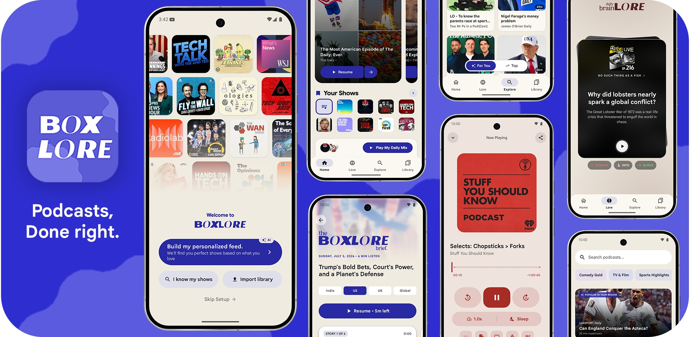

<div align="center" id="top">



### A podcast app that actually gets personal

*Open source under GPL v3. No ads. Ever.*

<br/>

<a href="https://play.google.com/store/apps/details?id=cx.aswin.boxlore">
  
</a>
&nbsp;
<a href="https://github.com/ashwkun/boxlore/releases/latest/download/app-release.apk">
  
</a>

<br/><br/>

<a href="LICENSE">
  
</a>


</div>


## About

Every podcast app I've used feels the same. They call an open API, do word-for-word search, let you subscribe, and show Apple charts. None of them really recommend things or get personal.

Spotify and Pocket Casts do personalize, but you're paying with ads or a subscription — and Spotify's podcast UI is rough.

**boxlore** is my attempt at a smarter podcast app. It learns as you listen: natural-language search, personalized picks, and discovery that goes beyond typing a show title. No ads, no paywall for the stuff that matters.

The smart layer runs on a search index that is rebuilt daily and covers popular chart podcasts — not every podcast on earth yet. It evolves every day and gets bigger. Recommendations and semantic search work best within that catalog; everything else still works as a normal podcast client.

---

## What makes it different

### Semantic search

Search episodes by meaning, not exact keywords. Ask *"stories about startup failure"* or *"deep dive on black holes"* in the Episodes tab and get relevant matches — not just titles that happen to contain those words.

### For You

Personalized episode picks on Home and Explore, based on what you've listened to, your genre interests, and your subscriptions. When the app knows your taste, sections are labeled **Based on Your Taste**; otherwise you'll see **Popular in your Region**. There's also a **Because You Like** row tied to a favorite show.

### Curiosity cards

On the Learn tab, swipe through question cards that point you at episodes you might not have found on your own. Swipe right to queue, left to dismiss, tap to play. Dismissals are remembered so you don't see the same card twice.

### No ads, forever

No banner ads, no sponsored inserts, no premium tier to unlock search or recommendations.

---

## Getting set up

First launch gives you a few ways in — pick what fits how you already listen.

### New to podcasts? Let us help you find your taste.

**AI onboarding** is the default path. A short chat with our AI about your preferences in natural language or via suggested options is all it takes, boxlore turns that into semantic search queries, pulls matching shows from the index, and builds a personalized feed of podcasts to follow. You pick what to subscribe to before entering the app. 

### Switching from another podcast app?

Switch to boxlore from Pocket Casts, Apple Podcasts, AntennaPod, or any app that exports OPML without rebuilding your library from scratch. On first launch, tap **Import library** and pick your `.opml` file — we will resolve each feed, subscribes your shows, and optionally marks back catalog as completed so your feed stays focused on new episodes. After import you get **similar-show recommendations** based on what you brought over.

OPML export is in **Profile → Backup & Restore** when you want to move on or keep a portable copy of your subscriptions. JSON backup is there too if you need full restore (history, likes, and settings).

### Already know what you follow?

**I know my shows** opens search during setup — subscribe manually, get similar-show suggestions if you want them, or **Skip Setup** and explore on your own.

---

## Screenshots

<div align="center">
<table>
  <tr>
    <td align="center" width="25%">
      <b>Onboarding</b><br/>
      <sub>AI feed, OPML import, or search</sub><br/><br/>
      
    </td>
    <td align="center" width="25%">
      <b>Home</b><br/>
      <sub>Mixtape, For You, briefing</sub><br/><br/>
      
    </td>
    <td align="center" width="25%">
      <b>Daily Briefing</b><br/>
      <sub>AI news audio — optional</sub><br/><br/>
      
    </td>
    <td align="center" width="25%">
      <b>Curiosity Cards</b><br/>
      <sub>Swipe to discover</sub><br/><br/>
      
    </td>
  </tr>
  <tr>
    <td align="center">
      <b>Semantic Search</b><br/>
      <sub>Natural-language episode search</sub><br/><br/>
      
    </td>
    <td align="center">
      <b>For You</b><br/>
      <sub>Personalized recommendations</sub><br/><br/>
      
    </td>
    <td align="center">
      <b>Library</b><br/>
      <sub>Subs, downloads, history</sub><br/><br/>
      
    </td>
    <td align="center">
      <b>Player</b><br/>
      <sub>Chapters, transcript, video</sub><br/><br/>
      
    </td>
  </tr>
</table>
</div>

---

## More features

<details>
<summary><b>Mixtapes</b></summary>
<br/>

Your home queue — up to 15 episodes pulled from subscriptions: what you're mid-way through plus unplayed new drops, scored so you can press play and keep listening without picking the next show yourself.
</details>

<details>
<summary><b>Daily briefing</b></summary>
<br/>

Region-specific AI news audio with a full script, sources, and chapter stories. Handy if you want a quick listen; skip it if AI briefs aren't your thing. It's there when you want it, not forced on you.
</details>

<details>
<summary><b>Smart Downloads vs auto-download</b></summary>
<br/>

These are two separate things:

- **Smart Downloads** (app-wide, off by default) — periodically builds a curated offline pool from your subscriptions, recommendations, and trending shows, within episode and storage limits you set.
- **Auto-download** (per podcast, off by default) — when a new episode drops on a show you follow, it downloads automatically. Requires notifications to be on for that show.
</details>

<details>
<summary><b>New episode notifications</b></summary>
<br/>

Per-podcast bell toggle. Get a push when a new episode lands; tap to open the show. Off by default. Can pair with auto-download so the episode is already on your phone.
</details>

<details>
<summary><b>Design</b></summary>
<br/>

Built with Material 3 and Material You. Shimmer skeletons while content loads, stable lists that don't jump around on refresh, smooth navigation transitions, and fast image loading. The goal is an app that feels fast and stays out of your way.
</details>

<details>
<summary><b>Player</b></summary>
<br/>

Mini player and expandable full player, queue management, variable speed (0.5×–1.5×), sleep timer, skip controls, synced transcripts, chapter navigation, video podcast support, and Android Auto.
</details>

<details>
<summary><b>Podcasting 2.0</b></summary>
<br/>

Native chapters and transcripts from the feed when publishers provide them. AI-generated transcript and chapters as a beta fallback when they don't (with a daily generation limit). Video podcasts play in a proper 16:9 layout.
</details>

<details>
<summary><b>Offline & library</b></summary>
<br/>

Subscriptions, downloaded episodes, listening history, and liked episodes in one place. Launch offline and you land on your downloads.

**Profile → Backup & Restore:** export or import subscriptions as **OPML** (works with any podcast app), or use **JSON** for a full boxlore backup — subs, playback history, likes, and app preferences.
</details>

---

## Codebase structure

<details>
<summary><b>Core modules</b></summary>
<br/>

* **`:core:data`** — Repositories (`PodcastRepository`, `PlaybackRepository`, `DownloadRepository`) and data mappers.
* **`:core:designsystem`** — Themes, typography, shared composables.
* **`:core:model`** — Domain models (`Episode`, `Podcast`, `Transcript`).
* **`:core:network`** — Podcast Index API and edge proxy clients.
</details>

<details>
<summary><b>Feature modules</b></summary>
<br/>

* **`:feature:explore`** — Search, For You, curiosity cards.
* **`:feature:home`** — Mixtape, charts, briefing card.
* **`:feature:player`** — Playback UI, transcripts, chapters.
* **`:feature:briefing`** — Daily briefing screen.
* **`:feature:library`** — Downloads, subscriptions, history.
* **`:feature:info`** — Podcast and episode detail pages.
</details>

---

## Tech stack

| Technology | Purpose |
|-----------|---------|
| **Kotlin** | 100% Kotlin codebase |
| **Jetpack Compose** | UI with Material 3 |
| **Coroutines & Flow** | Async and reactive state |
| **Retrofit 2** | REST API client |
| **Room** | Local database for history and library |
| **ExoPlayer (Media3)** | Audio and video playback |
| **Coil** | Image loading and color extraction |
| **Cloudflare Workers** | Edge proxy for search and recommendations |
| **bge-m3** | Embedding model for semantic search (1024-dim) |

---

## Data sources

| Source | Data provided |
|--------|---------------|
| **Podcast Index API** | Podcast and episode catalog, keyword search |
| **Apple Podcast Charts** | Daily trending feeds (US, IN, GB, FR) |

---

## Getting started

### Install

**Google Play** — [cx.aswin.boxlore](https://play.google.com/store/apps/details?id=cx.aswin.boxlore)

**APK** — Download from [Releases](../../releases) or use the badge at the top. Enable "Install from unknown sources" in Android settings if needed.

### Build from source

```bash
git clone https://github.com/ashwkun/boxlore.git
cd boxlore
./gradlew assembleDebug
./gradlew installDebug
```

**Requirements:** Android Studio Ladybug+, Android SDK 35+, JDK 17, Kotlin 1.9+

---

## Contributing

Contributions welcome.

1. **Report bugs** — Open an issue with steps to reproduce
2. **Suggest features** — Use Discussions
3. **Submit PRs** — Fork, code, open a pull request

---

## License

boxlore is **free and open source** under the [GNU General Public License v3.0](LICENSE).

- You may use, modify, and distribute this software
- Derivative works must also be open source under GPL v3
- You must disclose source code for any modifications you distribute
- No warranty is provided

---

## Contributors

<div align="center">
  <a href="https://github.com/ashwkun/boxlore/graphs/contributors">
    
  </a>
</div>

---

<div align="center">

Built by someone who listens to too many podcasts.

[⬆ Back to top](#top)

</div>
