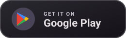

<div align="center" id="top">


# boxlore

**Podcast player for Android** — search that works, personal picks, offline listening, no ads

<br/>

<table align="center">
  <tr>
    <td align="center" valign="middle">
<!-- download-play:start -->
<a href="https://play.google.com/store/apps/details?id=cx.aswin.boxlore"></a>
<!-- download-play:end -->
    </td>
    <td width="16"></td>
    <td align="center" valign="middle">
<!-- download-apk:start -->
<a href="https://github.com/boxcreate/boxlore/releases/latest/download/boxlore-v0.0.19.apk"></a>
<!-- download-apk:end -->
    </td>
  </tr>
</table>

<br/><br/>

<a href="LICENSE"></a>

<a href="https://play.google.com/store/apps/details?id=cx.aswin.boxlore"></a>
<a href="https://github.com/boxcreate/boxlore/releases/latest"></a>

<br/><br/>

**[About](#about)** ·
**[Release notes](#release-notes)** ·
**[Search](#search)** ·
**[Features](#features)** ·
**[Get started](#get-started)** ·
**[Screenshots](#screenshots)** ·
**[Install](#install)** ·
**[Developers](#for-developers)** ·
**[Roadmap](https://github.com/orgs/boxcreate/projects/2)**


</div>

## About

<a id="about"></a>

Most podcast apps call an open API, do word‑for‑word search, show Apple charts, and call it a day. Misspell a show name and you get nothing. Ask for a *topic* and you get title matches that miss the point. And once you’re in, the home screen rarely feels like *yours* — same rails for everyone, little that learns from what you actually play.

**boxlore** is built around both gaps. Find a show when the spelling is messy, or find shows and episodes by *idea* when you only know the vibe. Then the app gets personal as you listen: Home, Explore, queue, and downloads re‑rank on‑device from your taste — daypart rails, **Because You Like**, and **For You** picks, plus curiosity cards when you want something you’d never search for. Taste stays on your phone. Stream or download for offline, manage a real queue, and skip the ads and paywalls for the stuff that matters.

The smart catalog covers popular chart podcasts and grows daily — not every show on earth yet. Outside that index, boxlore still works as a normal podcast client (subscribe, play, download, OPML).

<!-- upcoming-changes:start -->

## Release notes

### Upcoming

<!-- release-upcoming:start -->
<b>🆕 New features:</b>
<ul align="left">
<li>Home-screen widgets can now match boxlore’s Theme, Background, and Colors, or continue following your launcher’s system colors. <a href="https://github.com/boxcreate/boxlore/pull/1002"></a></li>
<li>Choose which tab opens by default in Explore (For You or Top) and Subscriptions (Shows or New episodes). Direct links still open the tab they specify. <a href="https://github.com/boxcreate/boxlore/pull/1002"></a></li>
<li>Home now features a dismissible Video Spotlight with hand-picked video podcasts
<a href="https://github.com/boxcreate/boxlore/pull/1002"></a></li>
<li>The custom color picker can build a balanced Material 3 palette or keep the exact accent color you selected. <a href="https://github.com/boxcreate/boxlore/pull/1002"></a></li>
<li>Turn off Smart queue when you want to stay with one show; boxlore will only continue with newer episodes from that podcast. <a href="https://github.com/boxcreate/boxlore/pull/1001"></a></li>
<li>Cleaner Home moves Settings and Feedback into Library, leaving a quieter Home top bar. <a href="https://github.com/boxcreate/boxlore/pull/1001"></a></li>
</ul>
<b>⚡ Improvements:</b>
<ul align="left">
<li>Appearance and Privacy settings use clearer spacing and alignment, making options easier to scan. <a href="https://github.com/boxcreate/boxlore/pull/1002"></a></li>
</ul>
<!-- release-upcoming:end -->


### What's New · `v0.0.19` · 2026-08-18

<!-- release-whats-new:start -->
<!-- release-meta: version=v0.0.19 date=2026-08-18 -->
<b>🆕 New features:</b>
<ul align="left">
<li>Long-press an episode to select and manage many episodes together, including older or newer episodes across long shows. <a href="https://github.com/boxcreate/boxlore/pull/997"></a></li>
</ul>
<b>⚡ Improvements:</b>
<ul align="left">
<li>Home now has Daily Mix and Offline Mix, so downloaded episodes are one tap away when you want to listen without data. <a href="https://github.com/boxcreate/boxlore/pull/996"></a></li>
<li>Reinstalling from a Google backup no longer leaves Smart Downloads running while the setting looks off, and download artwork should stay visible. <a href="https://github.com/boxcreate/boxlore/pull/996"></a></li>
</ul>
<b>• High:</b>
<ul align="left">
<li>If you imported podcasts from another app in an older boxlore build, those shows are restored as normal catalog subscriptions. You may see a one-time repair banner; it will not loop. <a href="https://github.com/boxcreate/boxlore/pull/993"></a></li>
</ul>
<!-- release-whats-new:end -->

<!-- upcoming-changes:end -->

## Search

<a id="search"></a>

Two jobs. Same Explore search bar (and onboarding when you already know your shows).

| Find a show | Ask anything |
| :--- | :--- |
| Type a podcast name — typos welcome. Fast, typo‑tolerant lookup via [Meilisearch](https://github.com/meilisearch/meilisearch). Primary hits under **Matches**; extra coverage under **Also found**. | Describe a topic or mood. Concept search via [Qdrant](https://github.com/qdrant/qdrant) returns related shows and episodes by meaning — e.g. *“stories about startup failure”* finds the conversation, not just shared keywords. |

## Features

<a id="features"></a>

| | |
| :--- | :--- |
| **Personalization** | On‑device learning re‑ranks Home, Explore, queue, and downloads as you listen. Taste stays on your phone. Daypart rails, **Because You Like**, and For You. [How it works →](docs/recommendation-system.md) |
| **Curiosity cards** | Swipe question cards that point at episodes you’d never search for. Right to queue · left to dismiss · tap to play. |
| **Listening** | Mixtape queue, mini/full player, speed, sleep timer, chapters, transcripts, video, Android Auto. |
| **Library & offline** | Subs, downloads, history, likes. Launch offline → land on downloads. OPML / full JSON backup. |
| **Daily briefing** | Optional region‑aware AI news audio with script, sources, and chapters. |
| **No ads** | No banners, no sponsored inserts, no premium tier to unlock search or recommendations. |

<details>
<summary><b>Smart automation (defaults off)</b></summary>

- **Smart Downloads** — curated offline pool within limits you set
- **Per‑podcast auto‑download** — new drops download automatically (notifications required)
- **New episode notifications** — per‑podcast bell

</details>

## Get started

<a id="get-started"></a>

| New to podcasts? | Switching apps? | Know your shows? |
| :--- | :--- | :--- |
| **AI onboarding** — short chat → matched shows from the catalog → subscribe before you enter. | **Import library** — OPML from Pocket Casts, Apple Podcasts, AntennaPod, or similar. Similar‑show suggestions after import. | **I know my shows** — search during setup, or **Skip Setup** and explore. |

Export anytime: **Profile → Backup & Restore** (OPML or full JSON).

## Screenshots

<a id="screenshots"></a>

<div align="center">
<table>
  <tr>
    <td align="center" width="25%">
      <b>Onboarding</b><br/><sub>AI · OPML · search</sub><br/><br/>
      
    </td>
    <td align="center" width="25%">
      <b>Home</b><br/><sub>Mixtape · For You</sub><br/><br/>
      
    </td>
    <td align="center" width="25%">
      <b>Search</b><br/><sub>Name or idea</sub><br/><br/>
      
    </td>
    <td align="center" width="25%">
      <b>Briefing</b><br/><sub>AI news audio</sub><br/><br/>
      
    </td>
  </tr>
  <tr>
    <td align="center">
      <b>Curiosity</b><br/><sub>Swipe to discover</sub><br/><br/>
      
    </td>
    <td align="center">
      <b>For You</b><br/><sub>Personalized picks</sub><br/><br/>
      
    </td>
    <td align="center">
      <b>Library</b><br/><sub>Subs · downloads</sub><br/><br/>
      
    </td>
    <td align="center">
      <b>Player</b><br/><sub>Artwork‑matched</sub><br/><br/>
      
    </td>
  </tr>
</table>
</div>

## Install

<a id="install"></a>

Get it on **Google Play** (primary), or sideload the latest **GitHub APK**. Live Play vs GitHub release versions are in the status badges under the title.

<div align="center">
  <table>
    <tr>
      <td align="center" valign="middle">
        <a href="https://play.google.com/store/apps/details?id=cx.aswin.boxlore"></a>
      </td>
      <td width="16"></td>
      <td align="center" valign="middle">
        <a href="https://github.com/boxcreate/boxlore/releases/latest/download/boxlore-v0.0.19.apk"></a>
      </td>
    </tr>
  </table>
</div>

<br/>

Enable *Install from unknown sources* for sideloading.

```bash
git clone https://github.com/boxcreate/boxlore.git
cd boxlore
./gradlew assembleDebug
./gradlew installDebug
```

**Requirements:** Android Studio Ladybug+ · Android SDK 35+ · JDK 17 · Kotlin 1.9+

## For developers

<a id="for-developers"></a>

<details>
<summary><b>Modules &amp; stack</b></summary>

| Module | Role |
|--------|------|
| `:core:catalog` | Repositories, mappers |
| `:core:designsystem` | Themes, shared composables |
| `:core:model` | Domain models |
| `:core:network` | Catalog API client |
| `:feature:explore` | Search, For You, curiosity |
| `:feature:home` | Mixtape, charts, briefing entry |
| `:feature:player` | Playback UI |
| `:feature:briefing` | Daily briefing |
| `:feature:library` | Downloads, subs, history |
| `:feature:info` | Podcast & episode detail |
| `:feature:onboarding` | First‑run paths |

| Technology | Purpose |
|-----------|---------|
| **Kotlin** · **Compose** · **Material 3** | App UI |
| **Coroutines & Flow** | Async state |
| **Retrofit** · **Room** · **Media3** · **Coil** | Network, DB, playback, images |
| **[Meilisearch](https://github.com/meilisearch/meilisearch)** | Typo‑tolerant show search |
| **[Qdrant](https://github.com/qdrant/qdrant)** · **Qwen3** | Concept search & multilingual recommendations |

Agent notes: [`AGENTS.md`](AGENTS.md) · architecture: [`ARCHITECTURE.md`](ARCHITECTURE.md) · testing: [`docs/TESTING.md`](docs/TESTING.md)

</details>

## Contributing

1. **Bugs** — [Issues](https://github.com/boxcreate/boxlore/issues)
2. **Ideas** — [Discussions](https://github.com/boxcreate/boxlore/discussions)
3. **Roadmap** — [Projects kanban](https://github.com/orgs/boxcreate/projects/2)
4. **PRs** — Fork, change, open a pull request

## License

Source‑available under the [PolyForm Strict License 1.0.0](LICENSE). Noncommercial use of the code is allowed; redistribution and derivatives are not. See [LICENSE](LICENSE).

## Contributors

<div align="center">
  <a href="https://github.com/boxcreate/boxlore/graphs/contributors">
    
  </a>
</div>

<br/>

<div align="center">


because antigravity is free and i love podcasts.

**[⬆ Back to top](#top)**

</div>
