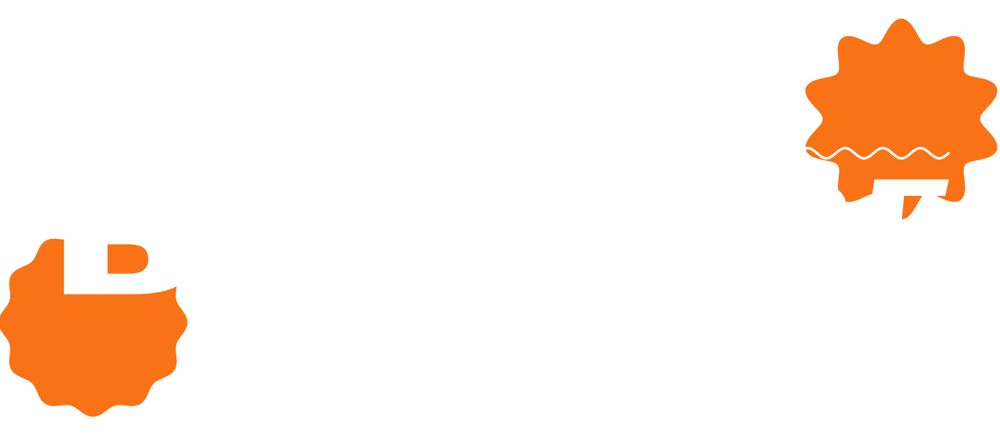

  

# Beautiful. Smart. Yours.

<b>Fast, ad-free podcasting crafted for Android.</b> 
Explore shows through semantic topic search, enjoy intelligent discovery tuned to your taste, 
and listen without paywalls, subscriptions, or ads.

 

<!-- download-play:start -->

<!-- download-play:end -->
&nbsp;&nbsp;
<!-- download-apk:start -->

<!-- download-apk:end -->
&nbsp;&nbsp;
<!-- download-obtainium:start -->

<!-- download-obtainium:end -->

 

**[About](#about)** ·
**[The soul of boxlore](docs/SOUL.md)** ·
**[What we track](docs/PRIVACY.md)** ·
**[Features](#features)** ·
**[Release notes](#release-notes)** ·
**[Screenshots](#screenshots)** ·
**[Install](#install)**

  

 

## About

**boxlore** is crafted to make podcast listening better. Built for listeners who care about quality software, it combines thoughtful audio and video controls with intelligent discovery—completely free of ads, subscriptions, and paywalls.

 

<table width="100%">
  <tr>
    <td width="33%" align="center" valign="top">
       
      
🎨

      <b>Beautiful</b> 
      Fluid Material 3 interface with dynamic theming, video playback, chapters, and clean controls.
        
    </td>
    <td width="33%" align="center" valign="top">
       
      
🧠

      <b>Smart</b> 
      Natural-language semantic search by topic, paired with hybrid vector recommendations.
        
    </td>
    <td width="33%" align="center" valign="top">
       
      
🔒

      <b>Yours</b> 
      Deep customization, full library ownership, and offline downloads. Zero ads, zero subscriptions, and no paywalls.
        
    </td>
  </tr>
</table>

 

| 📜 **[The soul of boxlore](docs/SOUL.md)** | 🔒 **[What we track and why](docs/PRIVACY.md)** |
| :---: | :---: |
| *Why this app is free, ad-free, and crafted with care.* | *How hybrid discovery works & full data transparency.* |

## Features

| Feature | What it does |
| :--- | :--- |
| **Find podcasts** | Search by show name, even with a misspelling, or describe a topic to find podcasts and individual episodes about it. |
| **Recommendations** | Hybrid discovery: Server-side semantic vector search using your recent listening seeds, with on-device tuning for your playback habits. |
| **Automatic queue** | When the list of episodes waiting to play runs low, Smart Queue can add more from the current show, unfinished listening, subscriptions, and recommendations. |
| **Audio and video player** | Play audio and video episodes with speed controls, a sleep timer, chapters, transcripts, intro skipping, and a queue you can reorder. |
| **Downloads and library** | Keep subscriptions, new episodes, downloads, likes, and listening history together. Smart Downloads can prepare episodes for offline listening. |
| **Alerts and widgets** | Choose which shows can send new-episode alerts. Home-screen widgets show playback controls, subscriptions, or new episodes. |
| **TV and car playback** | Send playback to supported TVs and speakers with Google Cast, or listen through Android Auto. |
| **More ways to discover** | Browse short question cards that lead to related episodes, or play an optional daily news briefing with sources and chapters. |
| **Import and backup** | Import a subscription file (OPML) from another podcast app, then export your subscriptions or a full library backup whenever needed. |
| **No app ads** | boxlore has no banner ads and does not charge to unlock features. Podcasts may still contain ads placed by their publishers. |

<!-- upcoming-changes:start -->

## Release notes

### Upcoming

<!-- release-upcoming:start -->
<b>🚨 Critical:</b>
<ul align="left">
<li>Fixed critical bugs related to Google sign in not working and onboarding authentication flow </li>
</ul>
<b>⚡ Improvements:</b>
<ul align="left">
<li>In-app feedback screen revamp with automatic draft recovery. </li>
<li>General stability optimizations and performance enhancements. </li>
</ul>
<!-- release-upcoming:end -->

### What's New · `v0.0.26` · 2026-09-25

<!-- release-whats-new:start -->
<!-- release-meta: version=v0.0.26 date=2026-09-25 -->
<b>🆕 New features & Cloud Sync:</b>
<ul align="left">
<li><b>**Realtime Cloud Sync**</b>: Keep subscriptions, playback progress, and queues in sync across your devices with conflict-resolved multi-device synchronization. </li>
<li><b>**Secure Accounts & Email Verification**</b>: Sign up with email and password featuring verified inbox confirmation, or sign in instantly with Google. </li>
<li><b>**Instant Playback Handoff**</b>: Pause an episode on your phone and resume listening seamlessly right where you left off on another device. </li>
<li><b>**Onboarding & Import Sync**</b>: Connect your account directly from welcome onboarding or library import sheets to restore shows immediately. </li>
</ul>
<b>⚡ Improvements & Polish:</b>
<ul align="left">
<li><b>**Modular Architecture**</b>: Decoupled settings, listening history, and auth into dedicated, focused feature and core modules. </li>
<li><b>**Library & Import Polish**</b>: Wider import option cards, responsive dialog dismissals, and enhanced account sync controls. </li>
<li><b>**Notice on Upcoming Fixes**</b>: We apologize that a few promised bug fixes couldn't make this build—they are queued and will ship in an update by next weekend!</li>
</ul>
<!-- release-whats-new:end -->

<!-- upcoming-changes:end -->

## Screenshots

<table>
  <tr>
    <td align="center" width="33%">
       
      <b>Home</b> Continue listening and see suggestions
    </td>
    <td align="center" width="33%">
       
      <b>Search</b> Find a name or explore a topic
    </td>
    <td align="center" width="33%">
       
      <b>Player</b> Controls, chapters, transcripts, and queue
    </td>
  </tr>
  <tr>
    <td align="center" width="33%">
       
      <b>Recommendations</b> Suggestions based on what you listen to
    </td>
    <td align="center" width="33%">
       
      <b>Library</b> Subscriptions, downloads, likes, and history
    </td>
    <td align="center" width="33%">
       
      <b>Daily briefing</b> Optional news audio with sources
    </td>
  </tr>
</table>

## Install

- **[Google Play](https://play.google.com/store/apps/details?id=cx.aswin.boxlore)** is the recommended install.
- **[GitHub Releases](https://github.com/boxcreate/boxlore/releases/latest)** provides the latest APK for sideloading.
- **[Obtainium](https://apps.obtainium.imranr.dev/redirect?r=obtainium://add/https://github.com/boxcreate/boxlore)** adds boxlore with automatic update tracking.

Android may ask you to allow installation from your browser or file manager when sideloading.

## Project

[Report a bug](https://github.com/boxcreate/boxlore/issues) ·
[Share an idea](https://github.com/boxcreate/boxlore/discussions) ·
[View the roadmap](https://github.com/orgs/boxcreate/projects/2)

boxlore is source-available under the [PolyForm Strict License 1.0.0](LICENSE). Noncommercial use is allowed; redistribution and derivative works are restricted by the license.

**[⬆ Back to top](#top)**

