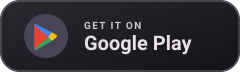
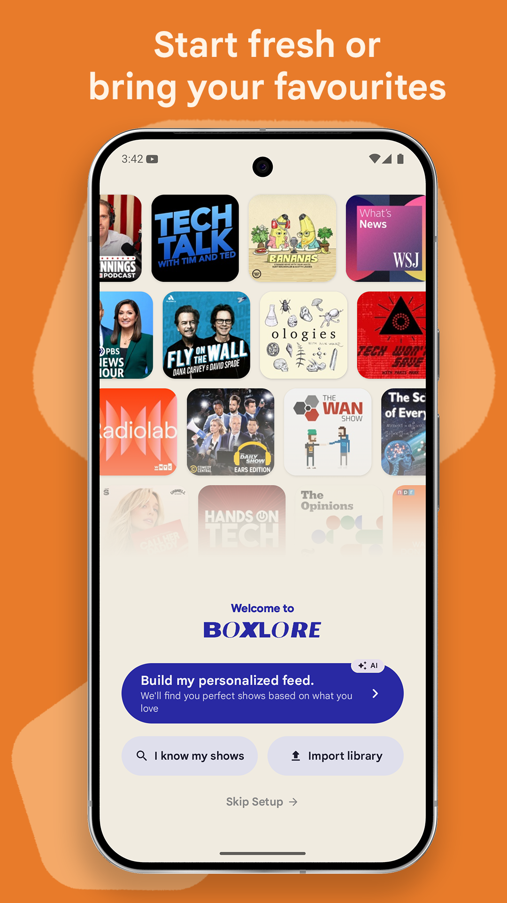
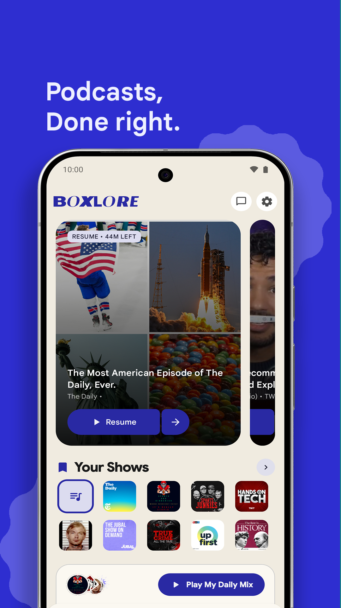
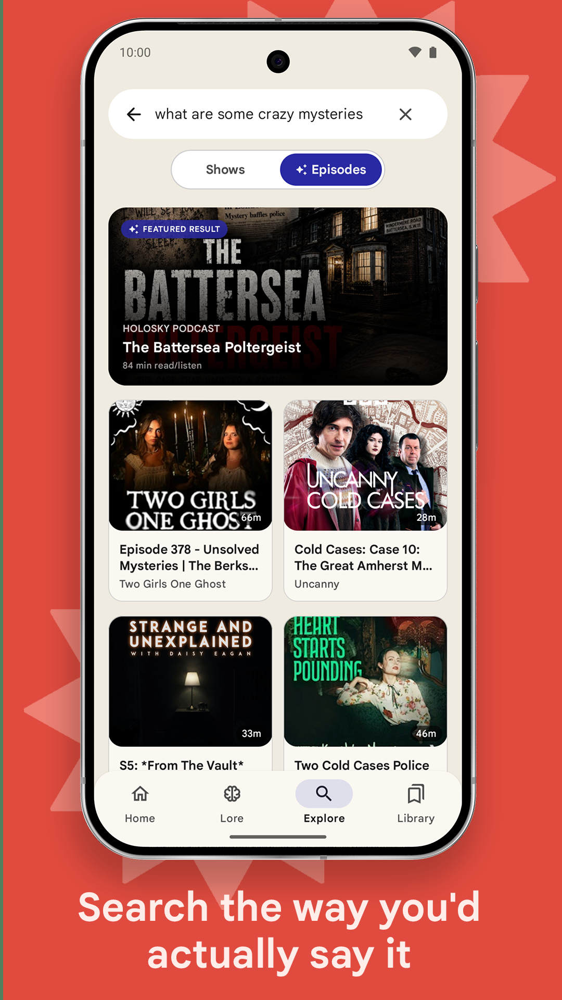
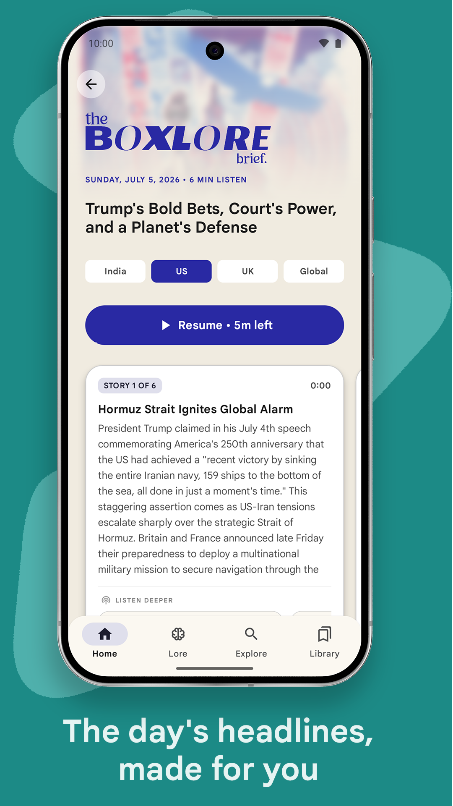
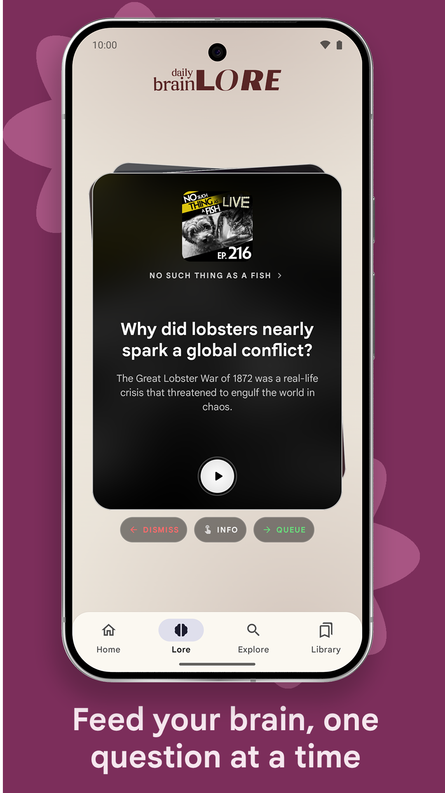
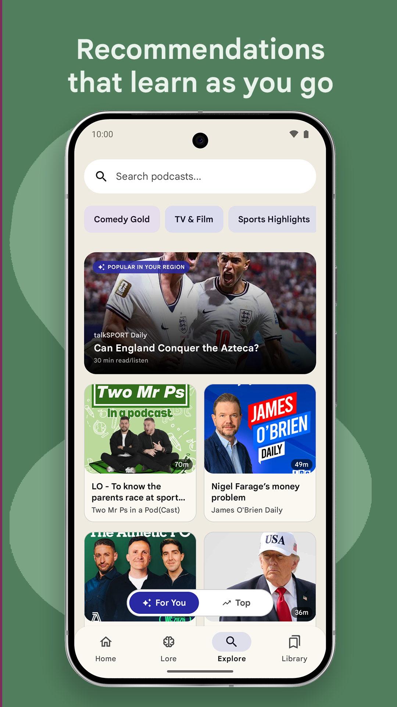
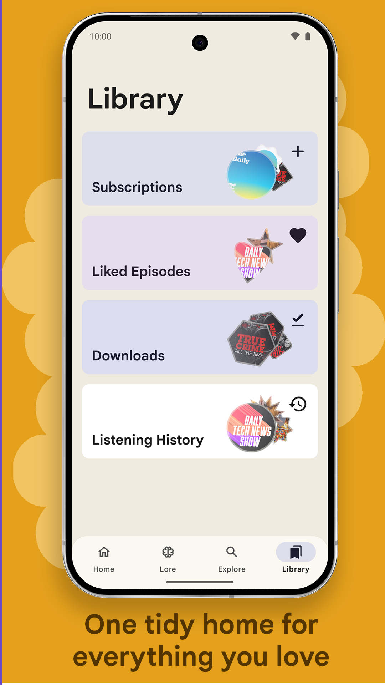
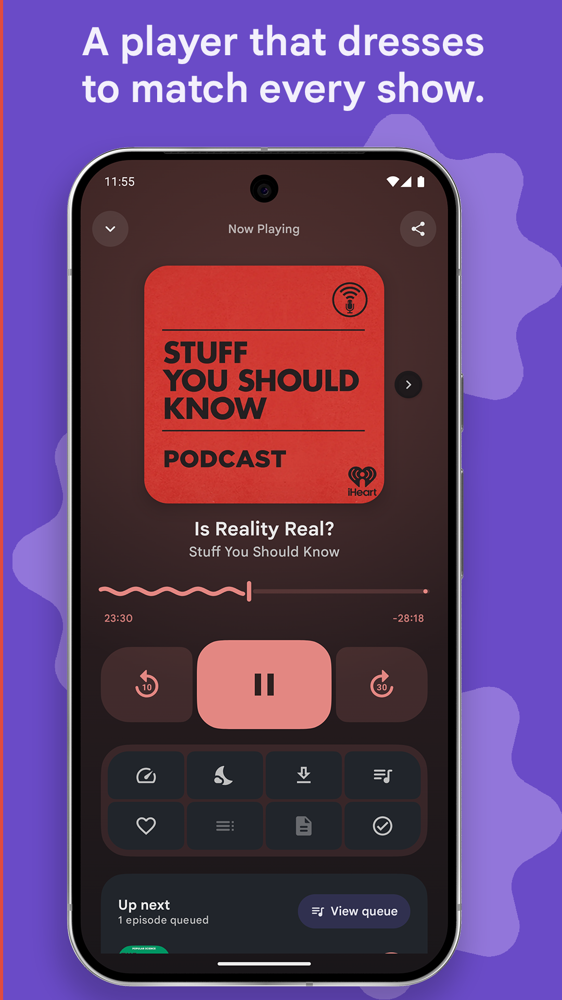

<div align="center" id="top">


# boxlore

**Free Android podcast app** — search that works, personal picks, offline listening, no ads

<br/>

<!-- download-apk:start -->
<a href="https://github.com/boxcreate/boxlore/releases/latest/download/boxlore-v0.0.13.apk">
  
</a>
<!-- download-apk:end -->
&nbsp;&nbsp;
<a href="https://play.google.com/store/apps/details?id=cx.aswin.boxlore">
  
</a>

<br/><br/>

<a href="LICENSE"></a>


<br/><br/>

**[About](#about)** ·
**[Release notes](#release-notes)** ·
**[Search](#search)** ·
**[Features](#features)** ·
**[Get started](#get-started)** ·
**[Screenshots](#screenshots)** ·
**[Install](#install)** ·
**[Developers](#for-developers)**


</div>

## About

<a id="about"></a>

Most podcast apps call an open API, do word‑for‑word search, show Apple charts, parse the RSS feed to play audio and call it a day. Misspell a show name and you get nothing. Ask for a *topic* and you get title matches that miss the point. And once you’re in, the home screen rarely feels like *yours* — same rails for everyone, little that learns from what you actually play.

**boxlore** is built around both gaps. Find a show when the spelling is messy, or find shows and episodes by *idea* when you only know the vibe. Then the app gets personal as you listen: Home, Explore, queue, and downloads re‑rank on‑device from your taste and fetches content that actually matters to you from our vector db using semantic matching — daypart rails, **Because You Like**, and **For You** picks, plus curiosity cards when you want something you’d never search for. Taste stays on your phone. Stream or download for offline, manage a real queue, and skip the ads and paywalls for the stuff that matters.

The smart catalog covers almost all the popular podcasts (~40k) and episodes (500k); still, not every show on earth yet, so it refreshes it catalogue everyday and keeps on growing. Outside that index, boxlore still works as a normal podcast client (subscribe, play, download, OPML).

<!-- upcoming-changes:start -->

## Release notes

<a id="release-notes"></a>

### Upcoming

<!-- release-upcoming:start -->
New features and improvements for the next release are currently in development.
<!-- release-upcoming:end -->

### What's New · `v0.0.13` · 2026-07-29

<!-- release-whats-new:start -->
<!-- release-meta: version=v0.0.13 date=2026-07-29 -->
<b>🆕 New features:</b>
<ul align="left">
<li>An all‑new way to search shows and episodes: typo‑tolerant podcast search powered by <a href="https://github.com/meilisearch/meilisearch">Meilisearch</a>, plus concept search for shows and episodes powered by <a href="https://github.com/qdrant/qdrant">Qdrant</a>. <a href="https://github.com/boxcreate/boxlore/pull/955"></a></li>
<li>Discovery expands with new chart countries — France, Germany, Netherlands, Singapore, Spain, Brazil, Russia, and Indonesia — alongside a new country picker and language filters, and stronger multilingual recommendations using <strong>Qwen3</strong> embeddings. <a href="https://github.com/boxcreate/boxlore/pull/953"></a></li>
</ul>
<b>⚡ Improvements:</b>
<ul align="left">
<li>Faster content delivery from backend optimizations so charts, search, and recommendations reach you sooner. <a href="https://github.com/boxcreate/boxlore/pull/953"></a></li>
<li>NotebookLM‑style briefings are tighter and less sloppy — more aware of repetition, depth, and which stories matter. <a href="https://github.com/boxcreate/boxlore/pull/949"></a></li>
<li>UI polish across startup, onboarding suggestions, Home and Explore search, and several other screens. <a href="https://github.com/boxcreate/boxlore/pull/954"></a> <a href="https://github.com/boxcreate/boxlore/pull/952"></a> <a href="https://github.com/boxcreate/boxlore/pull/953"></a></li>
</ul>
<!-- release-whats-new:end -->

<!-- upcoming-changes:end -->

## Search

<a id="search"></a>

Two jobs. Same Explore search bar (and onboarding when you already know your shows).

| Find a show | By idea |
| :--- | :--- |
| Type a podcast name — typos welcome. Fast, typo‑tolerant lookup via [Meilisearch](https://github.com/meilisearch/meilisearch). Primary hits under **Matches**; extra coverage under **Also found**. | Describe a topic or mood. Concept search via [Qdrant](https://github.com/qdrant/qdrant) returns related shows and episodes by meaning — e.g. *“stories about startup failure”* finds the conversation, not just shared keywords. |

## Features

<a id="features"></a>

| | |
| :--- | :--- |
| **Personalization** | On‑device learning re‑ranks Home, Explore, queue, and downloads as you listen. Taste stays on your phone. Daypart rails, **Because You Like**, and For You. [How it works →](docs/recommendation-system.md) |
| **Curiosity cards** | Swipe question cards that point at episodes you’d never search for. Right to queue · left to dismiss · tap to play. |
| **Listening** | Mixtape queue, mini/full player, speed, sleep timer, chapters, transcripts, video, Android Auto. |
| **Library & offline** | Subs, downloads, history, likes. Launch offline → land on downloads. OPML / full JSON backup. |
| **Daily briefing** | Optional region‑aware AI news audio with script, sources, and chapters. |
| **No ads** | No banners, no sponsored inserts, no premium tier to unlock search or recommendations. |

<details>
<summary><b>Smart automation (defaults off)</b></summary>

- **Smart Downloads** — curated offline pool within limits you set
- **Per‑podcast auto‑download** — new drops download automatically (notifications required)
- **New episode notifications** — per‑podcast bell

</details>

## Get started

<a id="get-started"></a>

| New to podcasts? | Switching apps? | Know your shows? |
| :--- | :--- | :--- |
| **AI onboarding** — short chat → matched shows from the catalog → subscribe before you enter. | **Import library** — OPML from Pocket Casts, Apple Podcasts, AntennaPod, or similar. Similar‑show suggestions after import. | **I know my shows** — search during setup, or **Skip Setup** and explore. |

Export anytime: **Profile → Backup & Restore** (OPML or full JSON).

## Screenshots

<a id="screenshots"></a>

<div align="center">
<table>
  <tr>
    <td align="center" width="25%">
      <b>Onboarding</b><br/><sub>AI · OPML · search</sub><br/><br/>
      
    </td>
    <td align="center" width="25%">
      <b>Home</b><br/><sub>Mixtape · For You</sub><br/><br/>
      
    </td>
    <td align="center" width="25%">
      <b>Search</b><br/><sub>Name or idea</sub><br/><br/>
      
    </td>
    <td align="center" width="25%">
      <b>Briefing</b><br/><sub>AI news audio</sub><br/><br/>
      
    </td>
  </tr>
  <tr>
    <td align="center">
      <b>Curiosity</b><br/><sub>Swipe to discover</sub><br/><br/>
      
    </td>
    <td align="center">
      <b>For You</b><br/><sub>Personalized picks</sub><br/><br/>
      
    </td>
    <td align="center">
      <b>Library</b><br/><sub>Subs · downloads</sub><br/><br/>
      
    </td>
    <td align="center">
      <b>Player</b><br/><sub>Artwork‑matched</sub><br/><br/>
      
    </td>
  </tr>
</table>
</div>

## Install

<a id="install"></a>

Use the **GitHub APK** button at the top of this page (latest release asset) or get it on Play:

<div align="center">
  <a href="https://play.google.com/store/apps/details?id=cx.aswin.boxlore">
    
  </a>
</div>

<br/>

Enable *Install from unknown sources* for sideloading.

```bash
git clone https://github.com/boxcreate/boxlore.git
cd boxlore
./gradlew assembleDebug
./gradlew installDebug
```

**Requirements:** Android Studio Ladybug+ · Android SDK 35+ · JDK 17 · Kotlin 1.9+

## For developers

<a id="for-developers"></a>

<details>
<summary><b>Modules &amp; stack</b></summary>

| Module | Role |
|--------|------|
| `:core:catalog` | Repositories, mappers |
| `:core:designsystem` | Themes, shared composables |
| `:core:model` | Domain models |
| `:core:network` | Catalog API client |
| `:feature:explore` | Search, For You, curiosity |
| `:feature:home` | Mixtape, charts, briefing entry |
| `:feature:player` | Playback UI |
| `:feature:briefing` | Daily briefing |
| `:feature:library` | Downloads, subs, history |
| `:feature:info` | Podcast & episode detail |
| `:feature:onboarding` | First‑run paths |

| Technology | Purpose |
|-----------|---------|
| **Kotlin** · **Compose** · **Material 3** | App UI |
| **Coroutines & Flow** | Async state |
| **Retrofit** · **Room** · **Media3** · **Coil** | Network, DB, playback, images |
| **[Meilisearch](https://github.com/meilisearch/meilisearch)** | Typo‑tolerant show search |
| **[Qdrant](https://github.com/qdrant/qdrant)** · **Qwen3** | Concept search & multilingual recommendations |

Agent notes: [`AGENTS.md`](AGENTS.md) · architecture: [`ARCHITECTURE.md`](ARCHITECTURE.md) · testing: [`docs/TESTING.md`](docs/TESTING.md)

</details>

## Contributing

1. **Bugs** — [Issues](https://github.com/boxcreate/boxlore/issues)
2. **Ideas** — [Discussions](https://github.com/boxcreate/boxlore/discussions)
3. **PRs** — Fork, change, open a pull request

## License

Source‑available under the [PolyForm Strict License 1.0.0](LICENSE). Noncommercial use of the code is allowed; redistribution and derivatives are not. See [LICENSE](LICENSE).

## Contributors

<div align="center">
  <a href="https://github.com/boxcreate/boxlore/graphs/contributors">
    
  </a>
</div>

<br/>

<div align="center">


because antigravity is free and i love podcasts.

**[⬆ Back to top](#top)**

</div>
