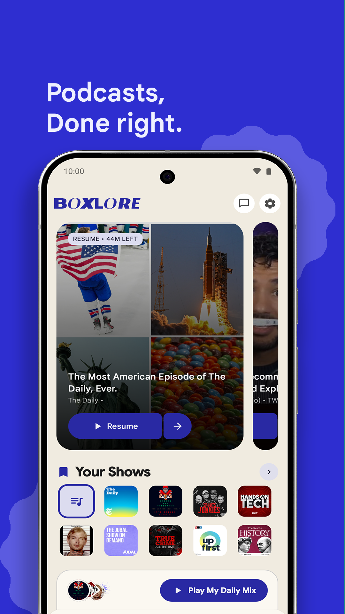
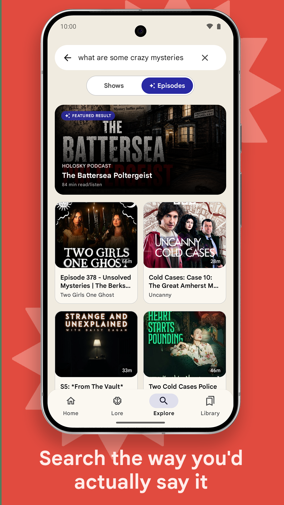
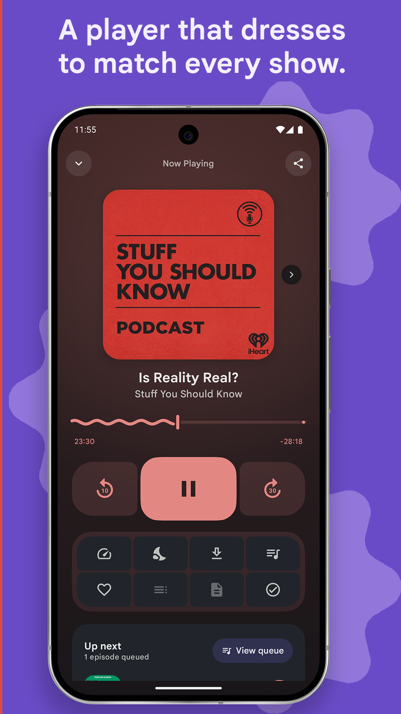
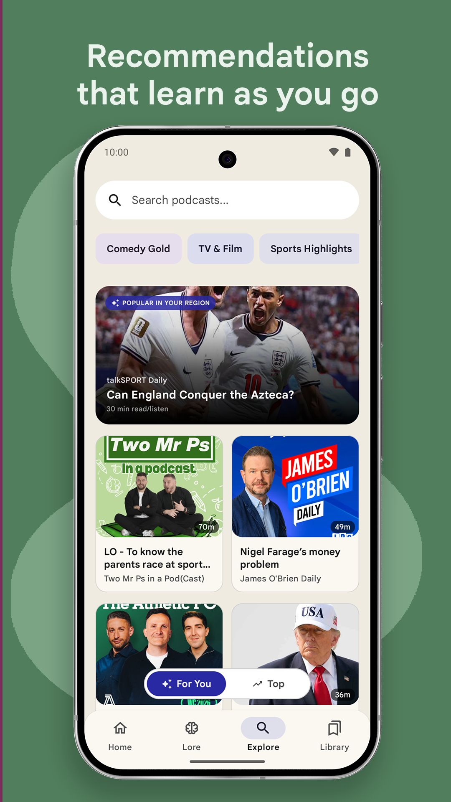
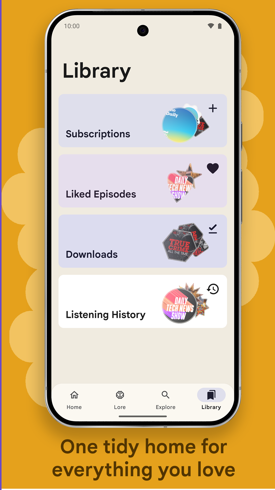
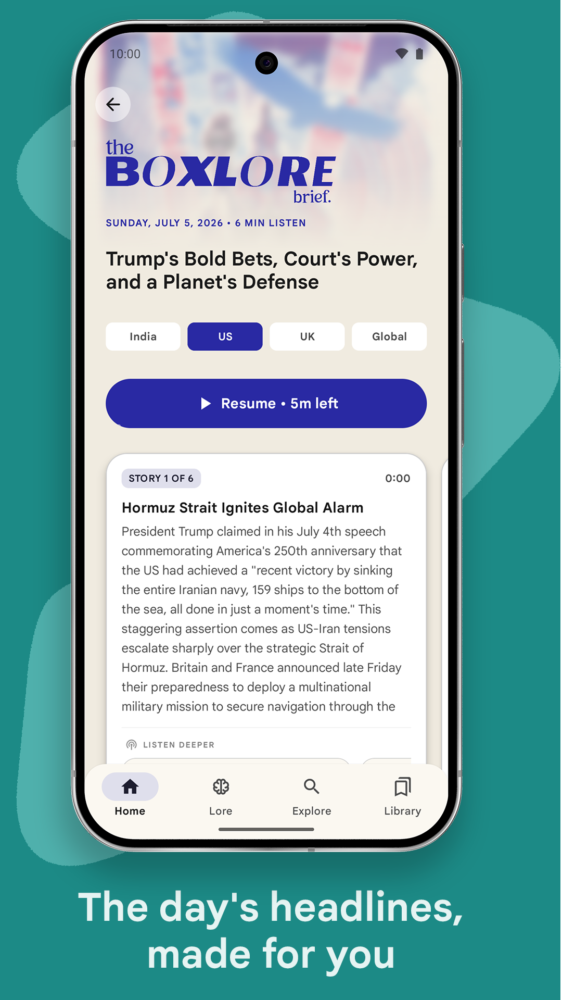

  

# Beautiful. Smart. Yours.

<b>Fast, ad-free podcasting crafted for Android.</b> 
Explore shows through semantic topic search, enjoy intelligent discovery tuned to your taste, 
and listen without paywalls, subscriptions, or ads.

 

<!-- download-play:start -->

<!-- download-play:end -->
&nbsp;&nbsp;
<!-- download-apk:start -->

<!-- download-apk:end -->
&nbsp;&nbsp;
<!-- download-obtainium:start -->

<!-- download-obtainium:end -->

 

**[About](#about)** ·
**[The soul of boxlore](docs/SOUL.md)** ·
**[What we track](docs/PRIVACY.md)** ·
**[Features](#features)** ·
**[Release notes](#release-notes)** ·
**[Screenshots](#screenshots)** ·
**[Install](#install)**

  

 

## About

**boxlore** is crafted to make podcast listening better. Built for listeners who care about quality software, it combines thoughtful audio and video controls with intelligent discovery—completely free of ads, subscriptions, and paywalls.

 

<table width="100%">
  <tr>
    <td width="33%" align="center" valign="top">
       
      
🎨

      <b>Beautiful</b> 
      Fluid Material 3 interface with dynamic theming, video playback, chapters, and clean controls.
        
    </td>
    <td width="33%" align="center" valign="top">
       
      
🧠

      <b>Smart</b> 
      Natural-language semantic search by topic, paired with hybrid vector recommendations.
        
    </td>
    <td width="33%" align="center" valign="top">
       
      
🔒

      <b>Yours</b> 
      Deep customization, full library ownership, and offline downloads. Zero ads, zero subscriptions, and no paywalls.
        
    </td>
  </tr>
</table>

 

| 📜 **[The soul of boxlore](docs/SOUL.md)** | 🔒 **[What we track and why](docs/PRIVACY.md)** |
| :---: | :---: |
| *Why this app is free, ad-free, and crafted with care.* | *How hybrid discovery works & full data transparency.* |

## Features

| Feature | What it does |
| :--- | :--- |
| **Find podcasts** | Search by show name, even with a misspelling, or describe a topic to find podcasts and individual episodes about it. |
| **Recommendations** | Hybrid discovery: Server-side semantic vector search using your recent listening seeds, with on-device tuning for your playback habits. |
| **Automatic queue** | When the list of episodes waiting to play runs low, Smart Queue can add more from the current show, unfinished listening, subscriptions, and recommendations. |
| **Audio and video player** | Play audio and video episodes with speed controls, a sleep timer, chapters, transcripts, intro skipping, and a queue you can reorder. |
| **Downloads and library** | Keep subscriptions, new episodes, downloads, likes, and listening history together. Smart Downloads can prepare episodes for offline listening. |
| **Alerts and widgets** | Choose which shows can send new-episode alerts. Home-screen widgets show playback controls, subscriptions, or new episodes. |
| **TV and car playback** | Send playback to supported TVs and speakers with Google Cast, or listen through Android Auto. |
| **More ways to discover** | Browse short question cards that lead to related episodes, or play an optional daily news briefing with sources and chapters. |
| **Import and backup** | Import a subscription file (OPML) from another podcast app, then export your subscriptions or a full library backup whenever needed. |
| **No app ads** | boxlore has no banner ads and does not charge to unlock features. Podcasts may still contain ads placed by their publishers. |

<!-- upcoming-changes:start -->

## Release notes

### Upcoming

<!-- release-upcoming:start -->
<b>⚡ Improvements:</b>
<ul align="left">
<li>Browse shows with clearer controls, compact episode cards and search that keeps the episode list in view. </li>
<li>Let podcast and episode pages match their artwork, or turn artwork colors off in Appearance. </li>
<li>Create your own theme with live light and dark previews. </li>
<li>Open episodes with clearer playback controls, artwork and reading layouts. </li>
<li>Find chapters and useful links more easily, with recognizable icons and shorter social profile labels. </li>
<li>Browse the show’s five latest episodes directly from the episode page. </li>
<li>Browse Home with clearer sections, sharper artwork and refreshed Daily Mix cards. </li>
<li>Enjoy updated colours and logos, with time-of-day animations that wait until the heading is in view. </li>
<li>Share episodes with cleaner “Listen on boxlore” branding. </li>
<li>Lore colors now blend as you swipe between cards. </li>
<li>Lore cards have more reading room, larger playback controls, and clearer swipe feedback. </li>
<li>The Lore queue prompt explains how to start a new queue or add episodes to your current one. </li>
<li>Imported RSS shows now refresh and support automatic and Smart Downloads. Existing imports upgrade while keeping your saved state. </li>
<li>Enable release notifications for public RSS feeds after confirmation. Keep notifications off for private or premium feeds because the shared checker publishes feed URLs in public backups. </li>
<li>Choose from sixteen new complete themes, with simple light/dark previews and clearer wallpaper and custom-color controls. </li>
<li>Automatic download settings are easier to read, with grouped controls and a separate help guide. </li>
<li>Backup background checks now clearly explain how they help when show notifications are off or do not arrive. </li>
</ul>
<b>🐛 Fixes:</b>
<ul align="left">
<li>Smoother page colors when opening details, loading another page or going back. </li>
<li>Featured-show cards now recognize more introductions to other podcasts. </li>
<li>Social links use a profile username when known, instead of repeating the platform name. </li>
<li>Daily Mix now uses show artwork when an episode has none. </li>
<li>A caught-up Daily Mix takes up less space. </li>
<li>Navigation highlights match your chosen accent, and the miniplayer stays above the navbar when Android navigation buttons are enabled. </li>
<li>When automatic downloads depend on opening boxlore, a notice explains this and offers to turn on show notifications. </li>
</ul>
<!-- release-upcoming:end -->

### What's New · `v0.0.28` · 2026-10-04

<!-- release-whats-new:start -->
<!-- release-meta: version=v0.0.28 date=2026-10-04 -->
<b>🚨 Critical:</b>
<ul align="left">
<li>Automatic downloads now recover new episodes when an episode alert is missing, resume after interruptions, and work with notifications turned off. Manually saved episodes stay protected. </li>
</ul>
<b>⚡ Improvements:</b>
<ul align="left">
<li>The floating player shrinks into a compact artwork control as you scroll, with playback progress kept visible and Lore moving into the navigation bar. </li>
<li>Enjoy refined miniplayer controls and smoother transitions into the full player. Optional seek buttons are available in Appearance settings. </li>
<li>Home loads more consistently, with smoother loading placeholders and less content blinking during refreshes. </li>
<li>Background episode checks are now optional in Auto-Download Settings. They start off, explain their battery and data costs, offer network and charging restrictions, and pause when the battery is low. </li>
<li>Auto-downloads still use new-episode pushes and normal refreshes while boxlore is open. Routine feed checks now share a six-hour cooldown and refresh large libraries in smaller batches. </li>
<li>Added a dedicated Support boxlore experience in Settings with interactive tactical artifacts and lore inspection. </li>
</ul>
<b>🐛 Fixes:</b>
<ul align="left">
<li>Floating tab selectors and Play All follow the player's compact position. </li>
<li>Lore colours follow the active artwork more reliably, and long Settings titles wrap across two lines. </li>
<li>New Episodes now plays the remaining list in order and resumes unfinished episodes at the right position. </li>
</ul>
<!-- release-whats-new:end -->

<!-- upcoming-changes:end -->

## Screenshots

<table>
  <tr>
    <td align="center" width="33%">
       
      <b>Home</b> Continue listening and see suggestions
    </td>
    <td align="center" width="33%">
       
      <b>Search</b> Find a name or explore a topic
    </td>
    <td align="center" width="33%">
       
      <b>Player</b> Controls, chapters, transcripts, and queue
    </td>
  </tr>
  <tr>
    <td align="center" width="33%">
       
      <b>Recommendations</b> Suggestions based on what you listen to
    </td>
    <td align="center" width="33%">
       
      <b>Library</b> Subscriptions, downloads, likes, and history
    </td>
    <td align="center" width="33%">
       
      <b>Daily briefing</b> Optional news audio with sources
    </td>
  </tr>
</table>

## Install

- **[Google Play](https://play.google.com/store/apps/details?id=cx.aswin.boxlore)** is the recommended install.
- **[GitHub Releases](https://github.com/boxcreate/boxlore/releases/latest)** provides the latest APK for sideloading.
- **[Obtainium](https://apps.obtainium.imranr.dev/redirect?r=obtainium://add/https://github.com/boxcreate/boxlore)** adds boxlore with automatic update tracking.

Android may ask you to allow installation from your browser or file manager when sideloading.

## Project

[Report a bug](https://github.com/boxcreate/boxlore/issues) ·
[Share an idea](https://github.com/boxcreate/boxlore/discussions) ·
[View the roadmap](https://github.com/orgs/boxcreate/projects/2)

boxlore is source-available under the [PolyForm Strict License 1.0.0](LICENSE). Noncommercial use is allowed; redistribution and derivative works are restricted by the license.

**[⬆ Back to top](#top)**

