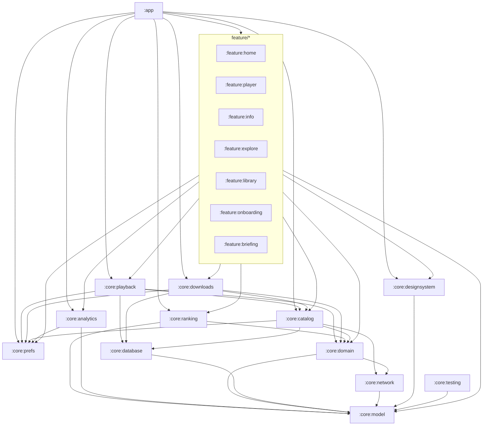

# Boxlore — Modular Android Hardening & Automation Plan

**Status:** Complete for program DoD — A0–A8 (A8 via Gradle≠package policy) + B0–B10 landed; optional polish (Roborazzi goldens, lint fail-on-error, Dependency Guard, `:core:catalog` rename) tracked as follow-ups  
**Branch context:** Builds on `cursor/full-refactor-tests-3b38` / PR #898  
**Audience:** Implementers continuing architecture, DI, tests, and module docs

---

## 0. Intent

Finish what the earlier playbook’s **target module map** listed but did not fully extract, then harden composition, testing automation, and **folder-level module READMEs** so Boxlore follows Android modularization best practices without becoming an over-fragmented toy architecture.

### Non-goals

- Do **not** merge identity-breaking renames (`applicationId`, DataStore name `user_preferences`, Room DB filename, `rss:` / negative IDs, mediaId prefixes, SharedPreferences keys such as `boxcast_prefs`).
- Do **not** introduce Hilt/Koin/MockK unless this plan is explicitly amended.
- Do **not** rewrite `feature/player` `v2/logic` behavior while migrating tests.
- Do **not** treat the root `README.md` / git docs as the module contract — **Gradle module folder READMEs** are the contract.

### Goals

1. **No remaining fat monoliths** — `:core:data` shrinks to a thin catalog/orchestration façade (or is retired once ownership is clear).
2. **Modular when needed** — split on ownership boundaries (lifecycle, deps, testability), not one-class-per-module.
3. **Single composition root** — UI, workers, and Media3 services consume `AppContainer` (or a tiny entry façade), never rebuild parallel graphs.
4. **Android best practices** — unidirectional module deps, clear public APIs, WorkManager/Service FQCN stability, testable ViewModels via ports, CI that guards regressions.
5. **Folder READMEs are exit criteria** — every phase that creates/moves modules updates those READMEs comprehensively; `ARCHITECTURE.md` + `docs/TESTING.md` stay the cross-cutting maps.

---

## 1. Principles (Android modular best practices)

### 1.1 When to create a module

Create a Gradle module when **at least two** are true:

- Distinct ownership (prefs ≠ ranking ≠ downloads ≠ playback)
- Different dependency fan-out (e.g. WorkManager/Media3 download vs DataStore-only)
- Independent testability (fakes/ports without pulling the world)
- Stable public API other features/core modules need

Do **not** split purely for folder aesthetics. Prefer packages inside a module until the boundary pays for itself.

### 1.2 Dependency rules (hard)

```text
feature/*  →  core/{playback,downloads,ranking,prefs,analytics,data?,designsystem,domain,model,network,database?}
core/X     →  only lower layers (never feature/*)
core/data  →  must not depend on designsystem
No feature → feature Gradle edges
```

Preferred long-term stack:

```text
app
  → feature/*
  → core/{playback, downloads, ranking, prefs, analytics, catalog/data, designsystem}
core/playback → core/{database, network, model, domain, prefs?}   # avoid fat data if possible
core/downloads → core/{database, network, model, domain, prefs}
core/ranking → core/{database|ranking-db, model, domain}
core/prefs → core/model
core/analytics → core/{model, prefs?}
core/domain → core/{model, network}   # ports + small DTOs only
core/database → core/{model, network} # QueueItem EpisodeItem debt until cleaned
```

Use **`api` vs `implementation` deliberately**: re-export only types callers must see; prefer `implementation` to hide internals.

### 1.3 Composition / DI (manual, intentional)

- Keep **manual DI** (`AppContainer` + assemblers). No framework unless amended.
- **Construct once** in `Application` / container; inject everywhere else.
- Ban new `getInstance` / process singletons except Room database builders with documented rationale.
- Workers/Services: `(application as BoxLoreApplication).container` or `WorkerFactory` that injects container deps.
- Construction order invariant remains:

```text
DB → PodcastRepository → QueueRepository → PlaybackRepository
  → QueueManager → SmartDownloadManager (+ ranking/RSS/prefs as peers, not second graphs)
```

### 1.4 FQCN / persistence stability

| Keep stable | Why |
| :--- | :--- |
| `applicationId = cx.aswin.boxlore` | Store / install identity |
| WorkManager worker class names (until alias window ends) | Persisted work requests |
| `BoxLorePlaybackService` / download service Manifest names | System bindings |
| DataStore `user_preferences`, DB filename, `rss:` IDs | User data |
| Pref keys `boxcast_*` | Existing installs |

Package renames inside new modules are allowed **only** with Manifest/`LegacyWorkerFactory` strategy and a README callout.

### 1.5 Module README contract (mandatory)

Every Gradle module folder README (`core/*/README.md`, `feature/*/README.md`, `app/README.md`) must stay aligned with `docs/MODULE_README_TEMPLATE.md` and, by plan end, include **all** of:

| Section | Required content |
| :--- | :--- |
| **Purpose** | Owns / does not own |
| **Public API** | Types features/app may depend on; “do not recreate” rules |
| **Internal structure** | Package/folder map |
| **Dependencies** | Gradle edges + forbidden reverse edges |
| **Threading / lifecycle** | Main vs IO; Application vs Activity scope |
| **Persistence & identity** | Prefs keys, DB names, FQCNs that must not change |
| **Testing notes** | `src/test` / `androidTest` locations, fakes, `testTag`s, how to run |
| **CI relevance** | Which workflow exercises this module (if any) |
| **See also** | `ARCHITECTURE.md`, `docs/TESTING.md`, related modules |

**Rule:** A phase that creates or moves code into a module is **not done** until that module’s folder README is comprehensively updated. Touch every consumer module README that changes its dependency edge.

Root `README.md` / CHANGELOG may be updated opportunistically; they are **not** substitutes for module READMEs.

---

## 2. Current baseline (rescan)

### 2.1 Modules today

```text
:app
:core:model | :core:network | :core:domain | :core:database
:core:data (still fat) | :core:playback | :core:designsystem | :core:testing
:feature:home | :feature:player | :feature:info | :feature:explore
:feature:library | :feature:onboarding | :feature:briefing
```

### 2.2 Fat leftovers in `:core:data`

- Downloads + workers (`DownloadRepository`, `SmartDownload*`, `AutoDownloadWorker`, `PurgeSmartDownloadsWorker`)
- Prefs (`UserPreferencesRepository`, scattered `boxcast_*` SharedPrefs access)
- Analytics (`AnalyticsHelper` object, session aggregators, PostHog hooks)
- Ranking (+ separate adaptive Room DB under `ranking/database/`)
- RSS (`RssFeedClient`, `RssPodcastRepository`)
- Catalog/content orchestration still mixed with the above
- Smart-queue helpers that are shared with playback (`SmartQueueEngine`, etc.)

### 2.3 Composition debts

- Remaining `getInstance`: RSS, ranking stack (`Adaptive*`, `RankingFeedback`, `RankingRuntimeControls`)
- Workers / `BoxLorePlaybackService` rebuild parallel dependency graphs
- `DownloadRepository` → `Class.forName(MediaDownloadService)` to dodge a compile edge
- `MainActivity` (~2.8k LOC) is the de-facto wiring hub
- Prefs constructed in multiple places (Application, MainActivity, VMs, service, workers)

### 2.4 Testing / CI baseline

| Layer | State |
| :--- | :--- |
| JVM unit | ~33 test files; Settings Turbine + player `v2/logic` strong; Home/Playback/DAOs/workers thin |
| androidTest | `:feature:home` Add-RSS only; in CI emulator job |
| Kover | Soft 8% on data+domain+home; **not** in CI |
| Maestro / screenshots | Scaffold only; local |
| Static analysis | No detekt/ktlint CI; lint often non-fatal |
| MockWebServer | On classpath; barely used |

### 2.5 Docs baseline

Folder READMEs exist for all current modules (P13) but many still describe transitional state (“further splits…”, incomplete testing notes). This plan requires them to become **accurate ownership contracts**.

---

## 3. Target architecture

### 3.1 Target Gradle map

```text
:app                          # thin: Application, AppContainer, NavHost, WorkerFactory
:core:model
:core:network
:core:domain                  # ports + small results only
:core:database                # main Room
:core:prefs                   # DataStore + documented SharedPrefs façades
:core:analytics               # tracking façade (no UI)
:core:ranking                 # adaptive ranking + its Room DB
:core:rss                     # optional if RSS deps stay heavy; else keep under catalog
:core:downloads               # DownloadRepository, SmartDownload*, workers
:core:playback                # PlaybackRepository, queue, Media3 services
:core:catalog                 # PodcastRepository + content orchestration (rename from slim data)
:core:designsystem
:core:testing
:feature:*                    # unchanged feature set
```

Naming note: prefer **`:core:catalog`** (or keep `:core:data` as a *thin* catalog module) once downloads/prefs/analytics/ranking/rss leave. Do not leave a junk-drawer `:core:data`.

Optional `:core:library` **only if** shared library-domain logic emerges that is not UI (`:feature:library` stays UI). Prefer packages in catalog/prefs over a vacuous module.

### 3.2 Target dependency diagram



### 3.3 Target composition

```text
BoxLoreApplication
  └─ AppContainer
       ├─ database, prefs, network clients
       ├─ catalog (PodcastRepository, RSS)
       ├─ ranking (scorer, feedback, adaptive repo)
       ├─ playback (PlaybackRepository, Queue*)
       ├─ downloads (DownloadRepository, SmartDownloadManager)
       └─ analytics façade
Workers / BoxLorePlaybackService / Feature assemblers
  └─ only consume AppContainer (or injected ports)
```

---

## 4. Phase plan

Phases are ordered for dependency safety. Each phase lists **code**, **tests**, **CI**, and **README exit criteria**. Prefer small PRs on a never-merge-until-ready branch unless product asks otherwise.

Characterise difficulty by **invasiveness** (Low / Med / High) and **blast radius** (modules touched), not calendar time.

---

### Phase A0 — Plan freeze & doc scaffolding

**Invasiveness:** Low  

- Land this plan under `docs/PLAN_MODULAR_ANDROID_HARDENING.md`.
- Expand `docs/MODULE_README_TEMPLATE.md` to the sections in §1.5.
- Update root `ARCHITECTURE.md` “Target module split” to point at this plan (status: in progress).
- Add a short “README checklist” section to `docs/TESTING.md` linking module README Testing notes.

**Exit:** Template + ARCHITECTURE pointer updated; no behavior change.

---

### Phase A1 — Single composition graph (DI hygiene)

**Status:** done — AppContainer `create`+`install` for RSS/ranking; `DownloadServiceLauncher`; single prefs via Application→container→VMs/FCM/PlaybackRepository; workers/service via holders; `AppContainerSmokeTest`.

**Invasiveness:** Med · **Blast radius:** app, data, playback, workers  

**Code**

1. Make `AppContainer` the sole constructor of:
   - `RssPodcastRepository` (drop `getInstance` for production path)
   - Ranking stack (`AdaptiveRankingRepository`, `RankingFeedbackRepository`, `AdaptiveCandidateScorer`, `RankingRuntimeControls`)
2. Inject those into `PodcastRepository`, `PlaybackRepository`, `DownloadRepository`, backup, content scorers.
3. `SmartDownloadWorker` / `AutoDownloadWorker` / `PurgeSmartDownloadsWorker` / `BoxLorePlaybackService` obtain deps from `BoxLoreApplication.container` (custom `WorkerFactory` already present — extend it).
4. Eliminate ad-hoc `UserPreferencesRepository(context)` constructions; one prefs instance from container.
5. Replace `Class.forName(MediaDownloadService)` with a `DownloadServiceLauncher` port implemented in playback/app.

**Tests**

- Container construction smoke (order + same instance identity for prefs/ranking/RSS).
- Worker doWork unit test with fake container/ports (at least SmartDownload path).

**README**

- `app/README.md` — document `AppContainer` public surface + WorkerFactory.
- `core/data/README.md` — “no getInstance for ranking/RSS in production”.
- `core/playback/README.md` — service obtains container; no parallel graph.

**Exit:** No production `getInstance` for ranking/RSS; workers/service use container; suite green.

---

### Phase A2 — Extract `:core:prefs`

**Invasiveness:** Med  

**Move**

- `UserPreferencesRepository`, theme fast-cache helpers, documented SharedPrefs façades for `boxcast_prefs` / related keys (API that features call instead of raw `getSharedPreferences`).

**Rules**

- Features/onboarding/home/explore stop reading `boxcast_prefs` directly; go through prefs façades.
- Prefs module depends only on `:core:model` (+ AndroidX DataStore).

**Tests**

- Prefs façade unit tests (defaults, migration of missing keys).

**README**

- New `core/prefs/README.md` (full §1.5).
- Update every feature README that depended on raw prefs.
- Update `ARCHITECTURE.md` module table.

**Exit:** No feature-level raw `boxcast_prefs` access except inside `:core:prefs`.

---

### Phase A3 — Extract `:core:downloads` ✅ DONE

**Invasiveness:** Med–High · **FQCN careful**  

**Move**

- `DownloadRepository`, `SmartDownloadManager`, `SmartDownloadWorker`, `AutoDownloadWorker`, `PurgeSmartDownloadsWorker`, related purge helpers.

**Rules**

- Keep worker FQCNs stable **or** extend `LegacyWorkerFactory` for one more release with README note.
- Downloads → catalog/database/prefs/domain; **not** → playback (use ports for history recommendations — already have `HistoryRecommendationSource`).
- App Manifest / data Manifest service references stay correct.

**Tests**

- SmartDownloadManager with fake `HistoryRecommendationSource` + fake download sink.
- Worker success/skip/disabled paths.

**README**

- New `core/downloads/README.md` (FQCN table mandatory).
- Update `core/data`, `core/playback`, `feature/library`, `app` READMEs.
- `ARCHITECTURE.md` edges.

**Exit:** Workers live in `:core:downloads`; data no longer owns WorkManager download stack. ✅ Landed on `cursor/full-refactor-tests-3b38`.

---

### Phase A4 — Extract `:core:analytics` ✅ DONE

**Invasiveness:** Low–Med  

**Moved**

- `AnalyticsHelper`, `PlayerSessionAggregator`, `PendingEntryPoint` → `core/analytics/src/main/java/cx/aswin/boxlore/core/data/analytics/` (package unchanged).
- `RankingAggregateTelemetry` data class → `:core:model` (breaks analytics→data ranking coupling).
- `Analytics` interface added; `AnalyticsHelper` implements it.
- `RecordingAnalytics` test-double added in `core/analytics/src/main/`.
- PostHog removed from `:core:data`; `:core:analytics` re-exported via `api(projects.core.analytics)`.

**Tests**

- `RecordingAnalyticsTest` + `DeriveGenrePersonaTest` in `core/analytics/src/test/`.

**README**

- New `core/analytics/README.md`.
- Updated `core/data/README.md`, `ARCHITECTURE.md` module table.

**Exit:** No static god-object required for new call sites; old aliases optional during transition.

---

### Phase A5 — Extract `:core:ranking`

**Invasiveness:** High  

**Move**

- Entire `ranking/` package including adaptive Room DB.
- Ports already in domain (`RankingResetPort`); add scoring/exposure ports as needed for features/tests.

**Rules**

- Ranking DB stays separate from main `BoxLoreDatabase` (already true).
- Features depend on ranking module or narrow ports — not on Room entities.

**Tests**

- Expand adaptive ranking JVM tests; feedback reset already covered via Settings.
- Optional: inspector snapshot pure functions.

**README**

- New `core/ranking/README.md` (DB filename, backup exclusion, debug surfaces).
- Update home/explore/debug READMEs.
- `docs/recommendation-system.md` cross-link only (not a module README).

**Exit:** `:core:data` / catalog has zero ranking Room/ksp dependency.

---

### Phase A6 — RSS & catalog shaping

**Invasiveness:** Med–High  

**Options (pick one in A6 kickoff):**

- **A6a:** Extract `:core:rss` (`RssFeedClient`, `RssPodcastRepository`, ID helpers) then leave `:core:catalog` = `PodcastRepository` + content orchestration.  
- **A6b:** Keep RSS inside `:core:catalog` if RSS and catalog always ship together.

Prefer **A6a** if RSS pulls OkHttp/RSS-parser weight that catalog consumers don’t need.

Rename slim leftover `:core:data` → `:core:catalog` (or document `:core:data` as catalog-only).

**Tests**

- RSS ID / matcher tests move with RSS module.
- Catalog MockWebServer tests for key API paths (see B2).

**README**

- Update/create `core/rss` and/or `core/catalog` READMEs; retire “fat data” language from `core/data/README.md`.

**Exit:** No junk-drawer module remains.

---

### Phase A7 — Shrink `:app` / `MainActivity`

**Status:** done — MainActivity ~137 LOC shell; `BoxLoreNavHost` + extracted ui/updates/surveys/fcm helpers; AppContainer only in Application.

**Invasiveness:** Med  

**Code**

- Extract nav graph (`BoxLoreNavHost` / per-destination route files).
- Feature route factories live next to features or in `app/navigation/`.
- Keep `AppContainer` creation in `Application` only.

**Tests**

- Navigation pure helpers if any; smoke androidTest for one deep link decode if cheap.

**README**

- `app/README.md` becomes the composition/nav map (not a paste of MainActivity).
- Feature READMEs document which routes they own.

**Exit:** `MainActivity` is shell-sized (theme + setContent + nav host host); no repo construction in Activity body.

---

### Phase A8 — Package hygiene (optional, last)

**Invasiveness:** High · **Do only after A1–A7 stable**  

**Status:** policy choice done — permanently document **Gradle module id ≠ Java/Kotlin package** in `ARCHITECTURE.md` (retain `cx.aswin.boxlore.core.data.*` for FQCN / prefs / ranking / rss / downloads / playback / database / analytics stability). Mass package renames deferred.

- ~~Align packages with module ids **or** permanently document “Gradle id ≠ package” as policy.~~ documented.
- Non-persistence renames: `BoxCastTheme` → `BoxLoreTheme`, log tags, briefing copy cleanup, BuildConfig `BOXLORE_*` with `.env` fallback from old keys (still optional).
- Remove `LegacyWorkerFactory` when analytics show no `boxcast` worker class names.
- Drop `boxcast://` Nav deep links when inbound traffic is zero.

**README:** every touched module + ARCHITECTURE invariants section.

---

## 5. Testing & automation plan

### 5.1 Layers (keep)

| Layer | Purpose | Location |
| :--- | :--- | :--- |
| JVM unit | Logic, ports, VMs, engines | `*/src/test` |
| Compose androidTest | Controls, tags, nav wiring | feature `androidTest` |
| Maestro | Device E2E smoke | `maestro/` |
| Screenshots | Visual baselines | `screenshots/baselines/` + Roborazzi later |
| Architecture tests | Module/dep rules | `:core:testing` or `:app` Konsist |
| Coverage gate | Floor + ratchet | Kover merged |

### 5.2 Automation phases

#### B0 — CI floors (quick wins)

**Status:** done for current floors — `:koverVerifyMerged` in `unit-tests.yml`; google-services stub action; unit + instrumented tests on **merge queue** (`merge_group`) + architecture boundary script (`scripts/ci/check-feature-no-boxlore-database.sh`); detekt + ktlint baseline checks run in that same CI job; non-blocking `./gradlew lintDebug` (`continue-on-error: true`).

- ~~Optional non-blocking `./gradlew lintDebug` job → then fail-on-error.~~ non-blocking step landed; fail-on-error later.
- ~~Add detekt/ktlint with baseline when ready.~~ done (see B9).

**Docs:** `docs/TESTING.md` CI table; module READMEs that participate in Kover.

#### B1 — Network contracts ✅

- Real MockWebServer tests for `BoxLoreApi` critical endpoints / DTO decoding (`:core:network`).
- Content-sections / bootstrap fixtures as needed by catalog.

**README:** `core/network/README.md` Testing notes with commands.

**Status:** done — `BoxLoreApiContractTest` + fixtures under `core/network/src/test`.

#### B2 — Hard VM & catalog tests

**Status:** advanced — Settings assembler/Turbine suite; Home `DiscoveryGreetingTest` + `PodcastAffinityLogicTest`; Info catalog/offline merge + error-port tests; domain local/offline ports. Catalog MockWebServer: `PodcastRepositoryCatalogTest` (trending + bootstrap fast success/error). Full Home/Info VM construction still deferred (Application).

**README:** `feature/home`, `feature/info`, `core/data` Testing notes.

#### B3 — Downloads / workers / playback slices

**Status:** done for the hardening pass — extraction + pure helpers landed; **worker unit tests** via fake holders + WorkManager testing (`SmartDownloadWorkerTest`, `AutoDownloadWorkerTest`).

**README:** `core/downloads`, `core/playback`.

#### B4 — Database tests

**Status:** minimal `PodcastDaoInMemoryTest` green with `includeAndroidResources` on `:core:database`. Document residual AAPT/`includeAndroidResources` pitfalls for dependents in `core/database/README.md` + `docs/TESTING.md`.

#### B5 — Expand instrumented CI

**Status:** advanced — Add RSS dialog coverage + hermetic `DownloadsSettingsPageUiTest` (`settings_downloads_*` tags). Same `:feature:home:connectedDebugAndroidTest` workflow.

#### B6 — Maestro nightlies

**Status:** scaffold done — `.github/workflows/maestro-nightly.yml` (cron UTC + `workflow_dispatch`) validates `maestro/*.yaml`; optional Maestro Cloud job when `MAESTRO_CLOUD_API_KEY` + `MAESTRO_PROJECT_ID` are set.

- ~~Workflow `maestro-nightly.yml` on schedule (not every PR).~~ done.
- Harden flows: reduce `optional: true`; seed prefs via adb / debug hooks (follow-up).
- ~~`maestro/README.md` + `docs/TESTING.md`.~~ done.

#### B7 — Screenshots

**Status:** staged — composition smoke replaces `@Ignore` stub; Roborazzi deferred on AGP 9; goldens path reserved under `screenshots/baselines/` (`docs/screenshots/README.md`).

#### B8 — Architecture-as-code

**Status:** done — Konsist + filesystem guards in `:core:testing` (`ArchitectureGuardTest`), run via `testDebugUnitTest` / `:core:testing:testDebugUnitTest`.

- **Konsist** (or similar) rules:
  - ~~no feature→feature deps~~
  - ~~no `getInstance` outside allowlist~~
  - ~~no designsystem dependency from data/catalog~~
  - ~~new modules must have README.md~~
- Optional **Dependency Guard** baselines for `:app` / `:core:catalog`.

#### B9 — Static analysis

**Status:** done for detekt + ktlint — detekt uses `config/detekt/{detekt.yml,baseline.xml}`; ktlint uses `org.jlleitschuh.gradle.ktlint` plus per-project baselines under `config/ktlint/`. CI runs `./gradlew detekt` and `./gradlew ktlintCheck` on merge queue (with unit tests), failing only on new quality/style issues beyond the committed baselines. ktlint format tasks are not wired into build or CI.

- Keep aligned with existing `.coderabbit.yaml` / Sonar — don’t fight duplicate rule noise.

#### B10 — Coverage ratchet

**Status:** floor raised 8 → **12** on merged variant (coverage allowed); documented ratchet **8 → 10 → 12 → 15 → 25** in `docs/TESTING.md` + root `build.gradle.kts`. Soft future gates for ranking/downloads noted.

- Raise further toward 15 / 25 as suites densify; optional module-specific gates for ranking/downloads.

---

## 6. Android best-practice checklist (apply continuously)

- [x] Unidirectional module dependencies; `api` minimized (Konsist + Gradle guards)
- [x] One Application-scoped graph; no hidden singletons (AppContainer + holders; create/install)
- [x] ViewModels depend on ports/interfaces; fakes in tests
- [x] UI state via `StateFlow` / Compose; no repo construction in Composables
- [x] WorkManager + foreground services use stable FQCNs + README tables
- [x] Network on background dispatchers; Main only for UI
- [x] Cleartext/backup flags explicit per Manifest (already fixed for playback)
- [x] Feature modules do not depend on each other (Konsist)
- [x] Design system has no data/network deps (Konsist)
- [x] Every module README matches reality after each phase (§1.5 matrix)
- [x] CI exercises unit + selected instrumented + coverage floor  

---

## 7. README update matrix (end state)

| Module folder | Must document by plan end |
| :--- | :--- |
| `app/` | AppContainer surface, WorkerFactory, nav ownership, CI stub for google-services |
| `core/model/` | Shared models; no Android framework deps beyond what’s already there |
| `core/network/` | API surface, MockWebServer tests, headers/App Check hooks |
| `core/domain/` | Ports list; what must not live here |
| `core/database/` | Entities/DAOs, migrations, DB filename, DAO test status |
| `core/prefs/` | DataStore + SharedPrefs façades; key stability table |
| `core/analytics/` | Façade API; PII rules; init ownership in app |
| `core/ranking/` | Adaptive DB, backup exclusion, debug inspector hooks |
| `core/rss/` (if created) | `rss:` IDs, feed client limits, ports |
| `core/downloads/` | Workers FQCN table, SmartDownload constraints |
| `core/playback/` | One PlaybackRepository rule, service FQCNs, queue ownership |
| `core/catalog/` or slim `core/data/` | PodcastRepository, content orchestration, deps |
| `core/designsystem/` | Theme/components; no data deps |
| `core/testing/` | Fixtures, dispatcher extension, shared fakes |
| `feature/*` | Public routes/screens, injected deps, testTags, smoke paths |

`docs/MODULE_README_TEMPLATE.md` is the template; module READMEs are the source of truth.

---

## 8. Definition of done (program)

The program is complete when:

1. **No fat junk-drawer module** — downloads, prefs, analytics, ranking (and RSS if split) are first-class modules; catalog is thin.  
2. **Single composition graph** — workers/services/UI share `AppContainer`; production `getInstance` paths gone (Room builder excepted).  
3. **Dependency rules enforced** — ideally via Konsist in CI.  
4. **Automation** — unit CI + Kover gate + network contracts + expanded androidTest; Maestro nightly; screenshot path chosen and documented.  
5. **All folder-level module READMEs** comprehensively match §1.5 and the README matrix.  
6. **`ARCHITECTURE.md` + `docs/TESTING.md`** reflect the final map (cross-cutting only).  
7. **Product invariants** preserved (identity, prefs keys, DB names, `rss:` IDs).  
8. **CI green** on unit + instrumented; Sonar clean on new code for the landing PRs.

---

## 9. Suggested PR / execution slicing

Keep PRs reviewable (CodeRabbit’s ~150-file limit is a practical constraint):

| Slice | Contents |
| :--- | :--- |
| PR1 | A0 docs + B0 CI floors |
| PR2 | A1 composition graph |
| PR3 | A2 prefs |
| PR4 | A3 downloads |
| PR5 | A4 analytics |
| PR6 | A5 ranking |
| PR7 | A6 catalog/rss |
| PR8 | A7 MainActivity shrink |
| PR9+ | B1–B10 automation increments |
| Optional | A8 package/identity polish |

Each PR updates **touched module READMEs in the same change**.

---

## 10. Risks & mitigations

| Risk | Mitigation |
| :--- | :--- |
| Worker FQCN break scheduled work | Alias factory + README; ship alias for one release |
| Pref key drift | Façades only; ban raw prefs in features via Konsist |
| Over-modularization | Follow §1.1; skip empty `:core:library` unless needed |
| Huge PRs skip CodeRabbit | Slice per §9 |
| Room/androidTest SDK pins | Document blockers; don’t block A-phases on DAO tests |
| Parallel graphs sneak back | Container-only rule + architecture tests |

---

## 11. Immediate next action

Automation floors (B0/B6/B8–B10) and A8 package policy are in place. Prefer finishing **B2** (full Home/Info VM construction), expanding **B5** hermetic androidTest, then **B7** Roborazzi when AGP allows; ratchet Kover **12 → 15**. Optional A8 polish (theme/log/BuildConfig renames, `LegacyWorkerFactory` removal) only with evidence.

---

## See also

- [`ARCHITECTURE.md`](../ARCHITECTURE.md) — live cross-module map  
- [`docs/MODULE_README_TEMPLATE.md`](MODULE_README_TEMPLATE.md) — module README skeleton  
- [`docs/TESTING.md`](TESTING.md) — test layers & CI  
- [`docs/recommendation-system.md`](recommendation-system.md) — ranking product context  
