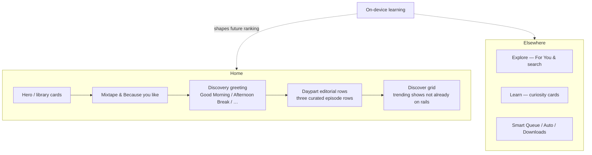
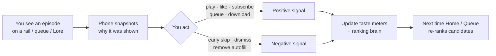
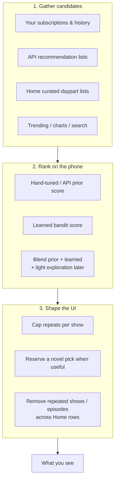
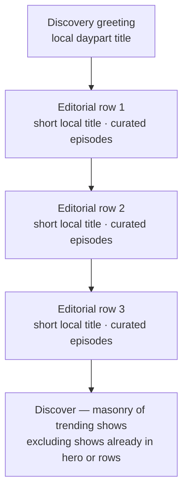
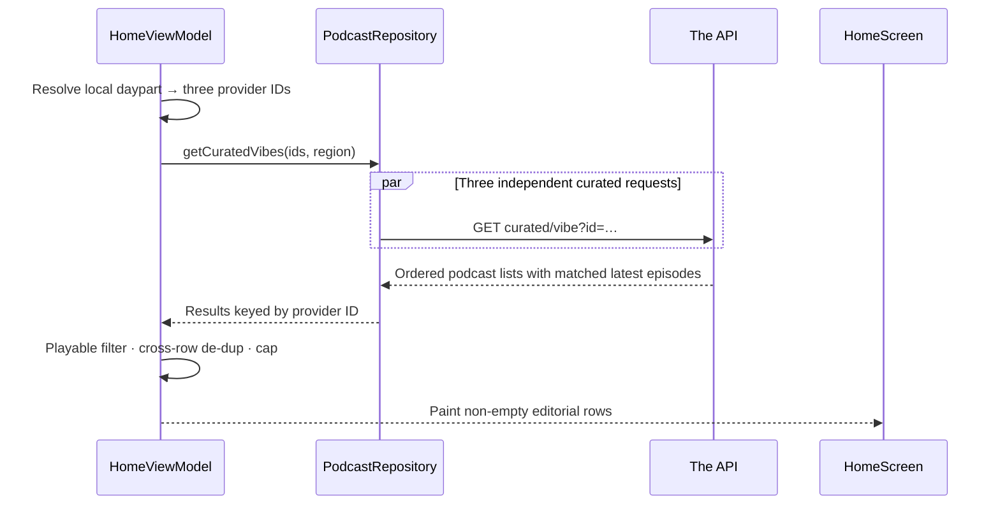
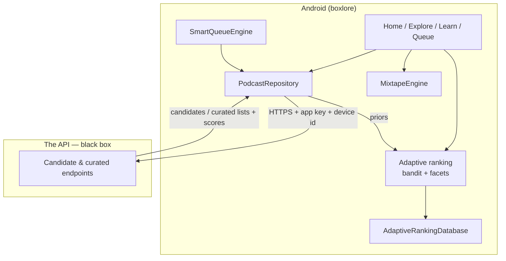
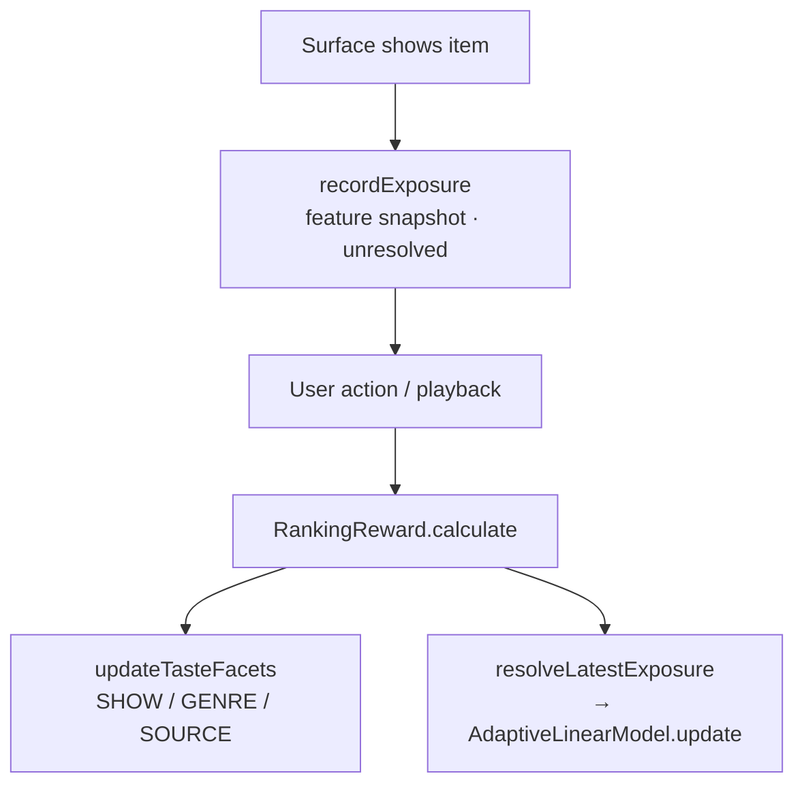
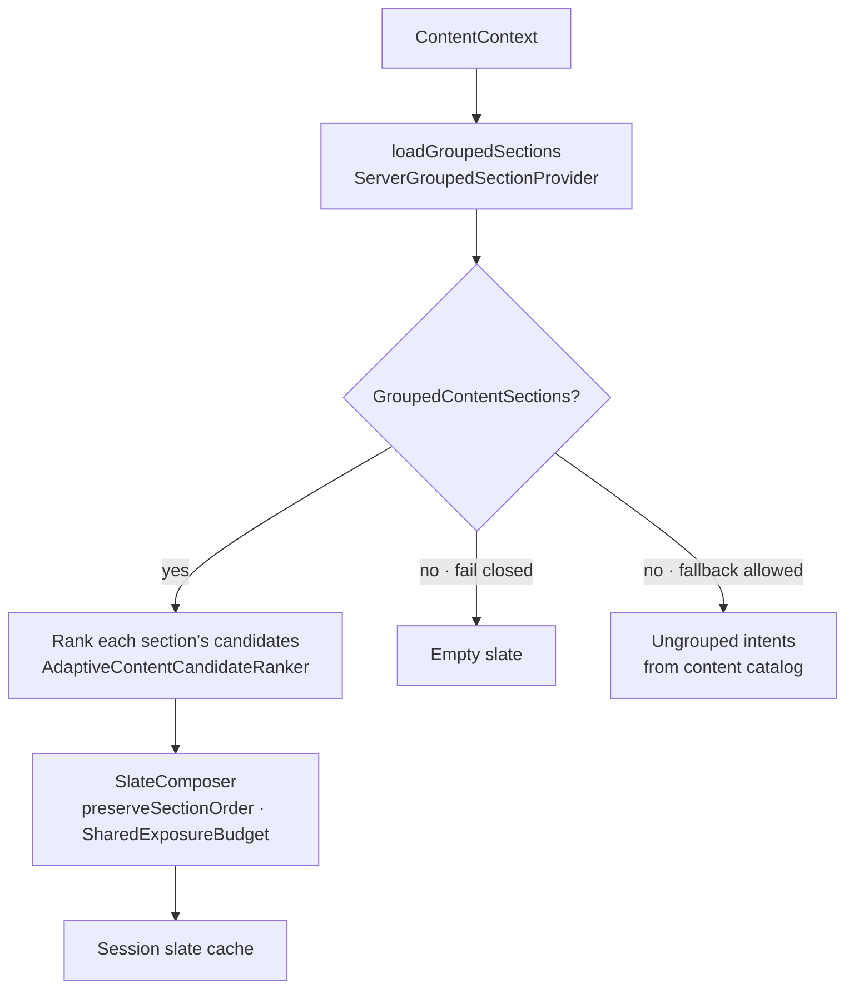
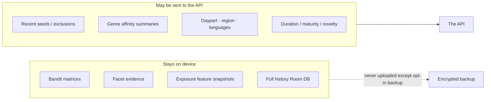
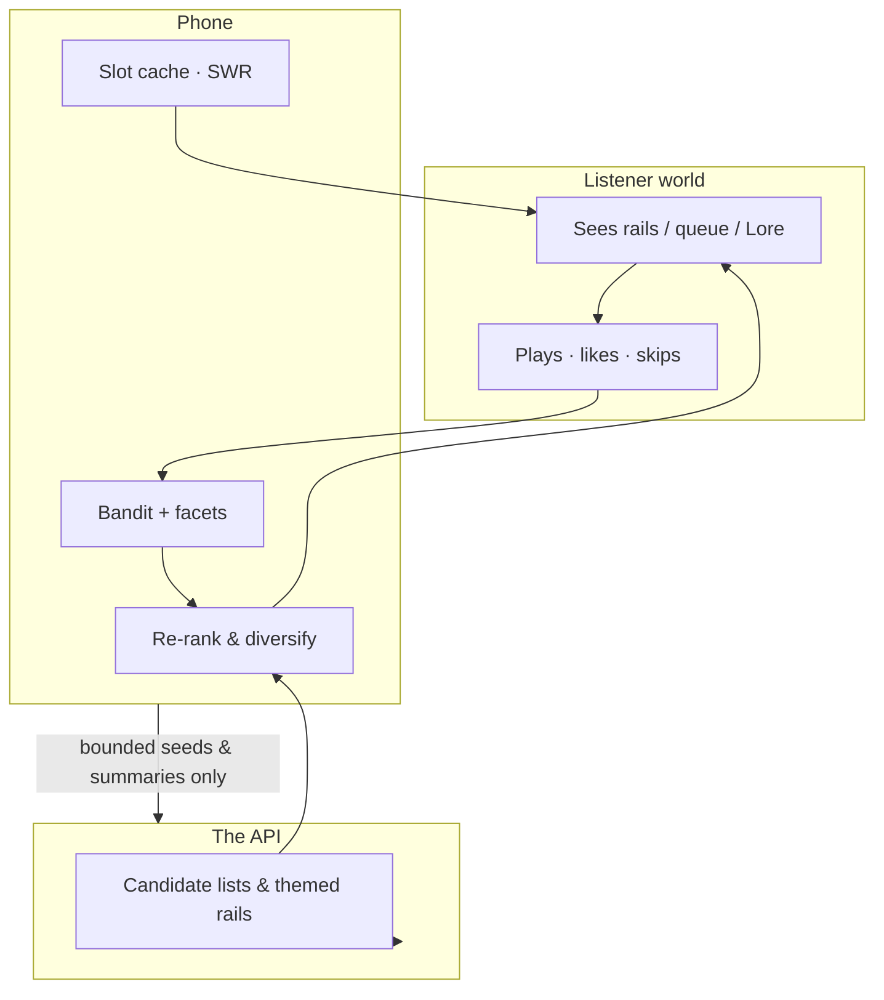

# boxlore Recommendation & Personalization System

> How boxlore decides what to show you, and how it learns from what you do.

This guide explains boxlore’s personalization in two layers:

1. **Simple guide** — what listeners notice, how Home rails work, and the learning loop in plain language.
2. **Engineer deep-dive** — on-device models, client pipelines, and the **black-box API contract** the app calls.

**Division of labor**

| Layer | Role |
|-------|------|
| **The API** | Stateless. Turns bounded seeds/filters into candidate lists and serves curated Home rows. |
| **Android client** | Stateful. Keeps the personalization model, records exposures, and re-ranks eligible candidate surfaces on-device. |

There is **no cloud user-profile store**. The learned model lives in a local Room database and is only uploaded as part of an **opt-in encrypted backup**.

**Privacy naming**

- This doc says **“the API”** only — never a separate backend repo name, base URL, or server source paths.
- Retrieval internals (vector indexes, edge caches, embedding providers, ETL jobs) are **out of scope**. What matters here is the **client contract** and **on-device learning**.

---

# Simple guide

## What you’ll notice in the app



| Place | What personalization does |
|-------|---------------------------|
| **Home editorial rows** | Three curated episode rows chosen for the current daypart |
| **Discover** | Chart/trending shows, with titles already on rails or hero cards filtered out |
| **Mixtape / Smart Queue** | Continues shows you actually listen to; avoids shows you keep skipping |
| **Because you like** | More like a show you’ve already enjoyed |
| **Explore search** | Semantic matches, then a light on-device taste reorder within relevance bands |
| **Learn (Lore)** | Swipe/play teaches genre & show preferences |

---

## How the phone learns (listener version)

Think of two memory systems that stay **on your phone**:

1. **Taste meters** — “I like this show / genre / source.” They fade toward neutral over months if you stop engaging.
2. **A small ranking brain** — “Given how an episode looks (fresh? familiar show? good duration?), how much should I boost it?” It starts cautious and earns influence as you listen.



**Plain rules of thumb**

- Watching something without acting barely teaches the model; **play, like, subscribe, queue, skip** do.
- A short skip after open is treated as a stronger negative than a long listen that you abandon late.
- Cold start is safe: with little history you mostly see charts, curated themes, and API candidates — the learned blend ramps in gradually (roughly after dozens of outcomes).

---

## How recommendations are built (listener version)

Personalization is a pipeline, not a single magic score:



**API vs phone (one sentence each)**

- **API:** “Given these seeds and filters, here are relevant candidates; for Home dayparts, here are curated lists.”
- **Phone:** “Given *your* recent behavior, reorder eligible surfaces and present Home rows without repetition.”

---

## Curated Home editorial rows

This is the main Home discovery surface after the greeting (“Good Morning”, “Afternoon Break”, …).

### What the listener sees



- Each daypart has three stable provider IDs. Those IDs are internal; listener-facing titles,
  subtitles, and icons are local editorial copy.
- The API preserves the curated ordering. The client requires a playable latest episode,
  removes duplicate podcasts and episodes across all three rows, caps row length, and omits
  an empty row.
- While loading, Home shows three matching rail skeletons (header + cards, no panel fill).
- **Discover** below the rows skips podcasts already featured above so the page does not
  immediately repeat the same shows.

### Client mental model



**Triggers (when Home refreshes rows)**  
Region or local daypart changes. `collectLatest` cancels the previous generation before the
new greeting’s results can paint.

**Home policy**  
Editorial rows load independently from personalized recommendations. A recommendation
failure cannot block this section, and a curated failure omits only the affected rows.

### What leaves the device

The curated requests send the selected provider ID and country. They do **not** send listening
history, learned genre affinities, subscriptions, model matrices, or recent section IDs.

### How learning relates to these rows

The rows preserve API order and are not re-ranked by the on-device bandit. Tapping or playing
an episode still flows through the normal playback and feedback paths, so the action can teach
other adaptive surfaces such as recommendations, Mixtape, Explore, and queues.

---

## Surfaces at a glance

| Surface | Feels like | Engine (client) | API (paths only) |
|---------|------------|-----------------|------------------|
| Home — editorial rows | Three daypart rows under the greeting | `HomeViewModel` + deterministic sanitization | `GET curated/vibe` |
| Home — Mixtape | Your listening queue strip | `MixtapeEngine` | `POST recommendations/v2` (fallback) |
| Home — Because you like | More like show X | Home UI | `POST recommendations/because-you-like` |
| Home — Discover | Charts / trending masonry | `HomeViewModel` filters | `GET trending` / bootstrap |
| Explore — For You | Broader discovery list | Explore + adaptive score | `POST recommendations/v2` |
| Explore — search | Natural-language find | Explore + light re-rank | `GET search/semantic` |
| Learn | Curiosity cards | `LearnViewModel` | `GET curated/curiosity-v3` |
| Smart Queue / Auto | Keep listening | `SmartQueueEngine` | `recommendations/v2`, `episodes/similar`, `trending` |
| Downloads | Offline picks | Smart download + `OFFLINE` objective | `recommendations/v2` |

---

# Engineer deep-dive (on-device)

## Architecture at a glance



Key packages:

- `:core:ranking` — bandit, facets, reward, features, diagnostics, and persistence under package `cx.aswin.boxlore.core.ranking`.
- `:core:catalog` — Home API orchestration plus retained grouped-section contracts and caches.
- `:core:playback` — Mixtape and Smart Queue surface engines.
- `:core:network` `BoxLoreApi` — Retrofit boundary.

---

## The learned model — `AdaptiveLinearModel`

File: `core/ranking/.../ranking/AdaptiveLinearModel.kt`

Per-objective **regularized online linear model** with optional UCB exploration (LinUCB-style).

### State (`AdaptiveModelState`)

| Field | Meaning |
|-------|---------|
| `covariance` (`A`) | `d×d`, init `RIDGE · I` (ridge = `1.0`). Accumulates `Σ xxᵀ`. |
| `inverseCovariance` (`A⁻¹`) | Cached inverse, Gauss-Jordan each update. |
| `rewardVector` (`b`) | `Σ x · reward`. |
| `updateCount` | Resolved outcomes. |
| `featureSchemaVersion` / `dimension` | Schema guard (`dimension = 18`). |

Learned weights: **`θ = A⁻¹ · b`**.

### Scoring

```
rawLearned  = θ · x
learned     = tanh(rawLearned)
uncertainty = α · sqrt(xᵀ A⁻¹ x)          // α = 0.15
blend       = min(updateCount/50, 1) · 0.65
final       = clamp( (1-blend)·prior + blend·learned + uncertainty , -1, 1)
```

- Prior always keeps ≥35% weight at full blend.
- UCB only when the objective `allowsExploration` **and** `updateCount ≥ 50`.

### Learning (`update`)

```
A ← forgetting·A  +  (1-forgetting)·RIDGE·I(diagonal)  +  x·xᵀ
b ← forgetting·b  +  x·reward
A⁻¹ ← invert(A)
updateCount += 1
```

`forgettingFactor = 0.995` — tastes can drift; ridge keeps `A` invertible.

Tests: `AdaptiveRankingTest` (cold start blend, offline never explores, opposite outcomes).

---

## Taste model — `BayesianPreferenceFacet`

File: `core/ranking/.../ranking/BayesianPreferenceFacet.kt`

Facet types: `SHOW`, `GENRE`, `SOURCE`, `DURATION_BUCKET`, `TIME_CONTEXT`, `INTENT`.

- Positive/negative evidence from rewards; **90-day half-life** decay.
- Affinity in `[-1, 1]` with symmetric Beta-style prior.
- Genre keys are **canonicalized** (`PodcastGenres`); placeholder `"Podcast"` is ignored.
- Migration (`pruneNonCanonicalGenreFacets`) **merges** alias evidence into canonical keys before deleting aliases.

Facets are features for the bandit **and** bounded genre affinities for `content/sections/v1`.

---

## Feature vector (18 dimensions)

`CandidateFeatureBuilder` / `FeatureSlot` — includes (among others) retrieval prior, freshness, duration fit, subscription/history flags, show/genre/source affinities, time context, novelty. Schema versioned; dimension mismatches refuse to load stale matrices.

---

## Reward model

`RankingReward` maps actions + listen fraction into `[-1, 1]`.

| Family | Examples |
|--------|----------|
| Strong positive | Complete, like, subscribe, explicit queue, manual download |
| Mild positive | Meaningful play, open details |
| Negative | Early skip, dismiss, remove autofilled, unlike / unsubscribe |

**Meaningful play:** ≥ 60s **or** ≥ 20% of duration. Playback service dedups rapid repeat actions (~5s).

---

## Learning loop end-to-end



If there was no exposure (e.g. deep link), **facets still update** so taste isn’t lost.

| Signal | Typical emitter |
|--------|-----------------|
| Queue / reorder / remove autofill | `PlaybackRepository`, `QueueRepository` |
| Like / subscribe / download | Playback / subscription / download repos |
| Play / complete / early skip | `BoxLorePlaybackService` |
| Lore open / dismiss | `LearnViewModel` |

---

## Retrieval → ranking → diversification → layout

### Candidate sources

`SUBSCRIPTION`, `LOCAL_HISTORY`, `SERVER_RECOMMENDATION`, `CURATED_INTENT`, `TRENDING`, `LIKED`, `DOWNLOADED`.

### Scoring

`AdaptiveCandidateScorer` builds features, `scoreBatch`es the bandit, normalizes heavy-tailed API priors with log1p. If adaptive ranking is gated off for a surface, falls back to prior / `PodcastScoring`.

### Diversification

`DiversityReranker`: de-dupe episodes, `maxPerShow`, genre/recent-show penalties, optional **novel slot**.

### Retained grouped-section engine — `ContentOrchestrator`



This engine and its API/cache contracts remain available for compatibility and future
grouped-section surfaces, but the current Home route does not construct or invoke it.

1. Grouped responses can still be mapped by `PodcastRepository.getPersonalizedContentSections`.
2. Eligible callers can rank items inside each section and compose with
   `preserveSectionOrder = true`.
3. `SharedExposureBudget` prevents the same episode/show dominating every section.
4. The content catalog still supplies intent metadata and fallbacks for callers that allow
   ungrouped composition.

---

## Objectives, surfaces, controls

| Objective | Exploration | Typical use |
|-----------|-------------|-------------|
| `DISCOVERY` | yes (after threshold) | Home recommendations, Explore, Lore |
| `CONTINUATION` | limited | Mixtape, Smart Queue |
| `YOUR_SHOWS` | no | Subscription ranking |
| `OFFLINE` | no | Downloads |

`RankingRuntimeControls` can disable adaptive re-ranking per (objective, surface) without breaking priors.

---

## Persistence, backup, pruning

- Room DB: models, facets, exposures.
- Exposures: retention + row cap (aggressive prune).
- Opt-in encrypted backup includes adaptive ranking state.
- Reset / “forget me” clears local ranking tables.

Debug inspector (local only): `learnerInspectorSnapshot()` — facets, exposures, feature weights; assembled off the main thread.

---

# API contract (black box)

The API is documented **by path and payload shape only**. How it retrieves or ranks internally is intentionally omitted.

## Endpoints the client uses

| Path | Role |
|------|------|
| `GET /curated/vibe` | **Home daypart editorial rows** (three internal provider IDs per daypart) |
| `POST /content/sections/v1` | Retained grouped-section contract; not called by current Home |
| `GET /content/catalog/v3` | Retained intent / catalog metadata |
| `POST /recommendations/v2` | Preferred seed-based candidate lists |
| `POST /recommendations` | Legacy v1 fallback (fuller history payload) |
| `POST /recommendations/because-you-like` | Home “Because you like” |
| `POST /episodes/similar` | Queue / episode-info neighbors |
| `POST` / `GET /home/bootstrap` | Cold-start briefing + trending (+ optional recs) |
| `GET /curated/curiosity-v3` | Learn / Lore deck |
| `GET /search/semantic` | Explore natural-language search |
| `GET /trending` | Charts / Discover / queue tiers |

**Auth (client view):** app key on requests; optional App Check JWT when enforced; device UUID scopes per-device caches; app version for analytics slicing.

## Retained grouped sections — `POST /content/sections/v1`

**Request (high level):** surface (`home`), local date / timezone offset / minute-of-day, country, languages, recent seeds, interests, subscribed / excluded IDs, taste signal summaries, duration preference, history maturity, novelty preference, recent section IDs, candidate budget, contract version.

**Response (high level):** `contractVersion`, `catalogVersion`, `resolvedDaypart`, `algorithmVersion`, `isFallback`, `sections[]` each with intent metadata + candidate items (scores/metadata for client priors).

**Eligible caller duties after response**

1. Reject / drop disk cache if `algorithmVersion` ≠ expected pin.
2. Map → `GroupedContentSections`.
3. Re-rank with `DISCOVERY` / intent objective.
4. Persist one active cache entry per daypart slot (+ latest pointer) when that caller uses
   the grouped-section cache.

## Recommendations v2 vs legacy v1

| | Legacy `POST /recommendations` | Current `POST /recommendations/v2` |
|--|--------------------------------|-------------------------------------|
| Input | Heavier history-oriented payload | Bounded **seeds** + exclusions + mode |
| Client learning | None in the old standalone path | Designed to feed on-device ranking |
| Failure mode | — | Client may fall back to v1, then local heuristics |

**Why v2 + on-device ranking wins for listeners**

- Less raw history leaves the device.
- Explicit exclusions (queued / seen) at request time.
- Richer candidate metadata for priors.
- Contract versioning (`contractVersion`, `mode`) for forward compatibility.
- Phone still owns personalization — API candidates are not the final order.

Legacy engagement-weight / cluster details from older write-ups are superseded; treat v1 as **compatibility fallback** only.

## Bootstrap, curated rows, curiosity, because-you-like

- **Bootstrap** — packs briefing + trending (+ recs) for first paint.
- **Curated rows** — Home resolves three internal daypart provider IDs, then presents local
  editorial titles and de-duplicated playable episodes.
- **Curiosity v3** — Lore cards; client filters dismissals and records exposures.
- **Because-you-like / similar** — show- or episode-seeded neighbor lists for UI modules and queue tiers.

## Caching (what the client relies on)

| Layer | Role |
|-------|------|
| API response caching | Opaque to the client; honor normal HTTP / bypass headers when debugging |
| Client memory | Current Home editorial rows plus short-TTL maps for recs / because-you-like |
| Client disk | Content catalog / grouped-section caches retained by `:core:catalog`, plus session prefs |
| Orchestrator session | In-memory `ContentSlate` only for callers that construct the retained engine |

Bypass for debugging: `Cache-Control: no-cache` or `?bypass_cache=true` where supported.

## Privacy boundary checklist



---

# Scenarios, diagnostics, reference

## Technical scenarios

### A — Cold start (day 1)

No history → Home still has daypart editorial rows plus region charts → recommendation
fallback may be broad → bandit blend ≈ 0 → facets start filling after first plays.

### B — Warm Home (many outcomes, clear genre taste)

Daypart editorial rows preserve curated order while personalized recommendations, Mixtape,
and Because You Like use learned signals → Discover omits shows already present above.

### C — Smart Queue after a discovery land

Queue asks v2 with exclusions → continuation objective ranks refill → skip memory down-ranks repeatedly skipped shows.

### D — Repeated early skips on one show

Negative rewards + SHOW facet drop → future Home/Queue priors and learned scores suppress that show.

### E — Explore semantic search

API returns relevance-ordered hits → client lightly re-ranks inside tie windows with `DISCOVERY`.

### F — Lore card swipe

Exposure on show → dismiss/play resolves → genre/show facets move → later Home rails and Explore feel the shift.

### G — Backup & restore

New device restores encrypted adaptive DB → learning stage continues instead of cold start.

### H — Network failure on Home editorial rows

The failed row is omitted after loading; recommendations and the rest of Home remain usable.

---

## Learning lifecycle (stages)

| Stage | Rough signal | UX feel |
|-------|--------------|---------|
| Cold start | ~0 outcomes | Charts, curated themes, API priors |
| Learning | Growing `updateCount` | Blend rises; facets sharpen |
| Adaptive | ≥ ~50 outcomes on an objective | Exploration eligible where allowed; stronger personal ranking |

Telemetry buckets (`cold_start` / `learning` / `adaptive`) are derived similarly for analytics.

---

## Diagnostics & safety

- Debug screen: Adaptive Learner inspector (local snapshot only).
- Runtime flags can disable adaptive re-rank per surface.
- Schema / algorithm version mismatches refuse bad cache or model rows.
- Home editorial provider failures are isolated from recommendations and other rows.
- Provider failures in the retained grouped-section orchestrator remain isolated.

---

## Type / file quick reference

| Concern | Types / files |
|---------|----------------|
| Bandit | `AdaptiveLinearModel`, `AdaptiveRankingRepository` |
| Facets | `BayesianPreferenceFacet`, `PodcastGenres` |
| Rewards | `RankingReward`, `RankingFeedbackRepository` |
| Home editorial rows | `HomeEditorialRowsLogic`, `HomeViewModel`, `HomeFeedEditorialRows` |
| Retained grouped sections | `ContentOrchestrator`, `SlateComposer`, `GroupedContentSectionProvider` |
| Retained sections cache | `ContentSectionsCachePolicy`, `PodcastRepository` helpers |
| Mixtape / Queue | `MixtapeEngine`, `SmartQueueEngine` |
| API boundary | `BoxLoreApi`, `ContentSectionsV1Request` / `Response` |

---

## Worked example — morning Home (client)

1. Daypart → “Good Morning” greeting and three morning provider IDs.
2. Home shows a matching three-panel skeleton while the requests run.
3. `GET curated/vibe` runs for each provider ID with the current region.
4. Client preserves API order, requires playable episodes, removes cross-row duplicates, and
   caps each row.
5. User opens item #2; curated tap analytics uses the internal provider ID.
6. Playback outcomes continue updating facets and the bandit for adaptive surfaces.
7. Discover excludes podcast IDs already present in editorial rows or the hero.

---

## Mental model (one diagram)



---

*Documentation only. Implementation details of API retrieval infrastructure are deliberately excluded; when in doubt, trust the Android client contracts in `core/network` and the ranking/content packages above.*
