# boxlore Recommendation & Personalization System

> How boxlore decides what to show you, and how it learns from what you do.

This guide explains boxlore’s personalization in two layers:

1. **Simple guide** — what listeners notice, how Home rails work, and the learning loop in plain language.
2. **Engineer deep-dive** — on-device models, client pipelines, and the **black-box API contract** the app calls.

**Division of labor**

| Layer | Role |
|-------|------|
| **The API** | Stateless. Turns bounded seeds/filters into candidate lists and themed Home rails. |
| **Android client** | Stateful. Keeps the personalization model, records exposures, re-ranks every list on-device. |

There is **no cloud user-profile store**. The learned model lives in a local Room database and is only uploaded as part of an **opt-in encrypted backup**.

**Privacy naming**

- This doc says **“the API”** only — never a separate backend repo name, base URL, or server source paths.
- Retrieval internals (vector indexes, edge caches, embedding providers, ETL jobs) are **out of scope**. What matters here is the **client contract** and **on-device learning**.

---

# Part A — Simple guide

## A1. What you’ll notice in the app

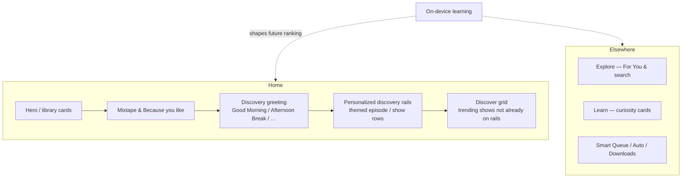

| Place | What personalization does |
|-------|---------------------------|
| **Home discovery rails** | Several themed rows under the daypart greeting, ranked to your taste |
| **Discover** | Chart/trending shows, with titles already on rails or hero cards filtered out |
| **Mixtape / Smart Queue** | Continues shows you actually listen to; avoids shows you keep skipping |
| **Because you like** | More like a show you’ve already enjoyed |
| **Explore search** | Semantic matches, then a light on-device taste reorder within relevance bands |
| **Learn (Lore)** | Swipe/play teaches genre & show preferences |

---

## A2. How the phone learns (listener version)

Think of two memory systems that stay **on your phone**:

1. **Taste meters** — “I like this show / genre / source.” They fade toward neutral over months if you stop engaging.
2. **A small ranking brain** — “Given how an episode looks (fresh? familiar show? good duration?), how much should I boost it?” It starts cautious and earns influence as you listen.

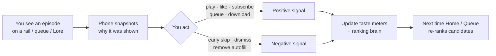

**Plain rules of thumb**

- Watching something without acting barely teaches the model; **play, like, subscribe, queue, skip** do.
- A short skip after open is treated as a stronger negative than a long listen that you abandon late.
- Cold start is safe: with little history you mostly see charts, curated themes, and API candidates — the learned blend ramps in gradually (roughly after dozens of outcomes).

---

## A3. How recommendations are built (listener version)

Personalization is a pipeline, not a single magic score:

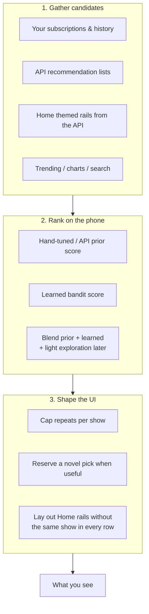

**API vs phone (one sentence each)**

- **API:** “Given these seeds and filters, here are relevant candidates / themed rails.”
- **Phone:** “Given *your* recent behavior, reorder and diversify those candidates for this screen.”

---

## A4. Personalized Home discovery rails

This is the main Home discovery surface after the greeting (“Good Morning”, “Afternoon Break”, …).

### A4.1 What the listener sees

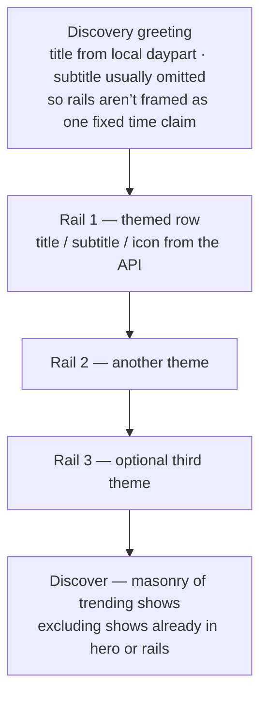

- Rails are **grouped sections**: each has an intent (theme) and a list of episode/show candidates.
- Titles and icons come from the API response (merged with the local content catalog when available).
- While loading with no cache, Home shows an **adaptive rails skeleton** — it does **not** wipe a good previous slate with an empty refresh.
- **Discover** below the rails deliberately skips podcasts already featured above so the page doesn’t repeat the same shows.

### A4.2 Client mental model

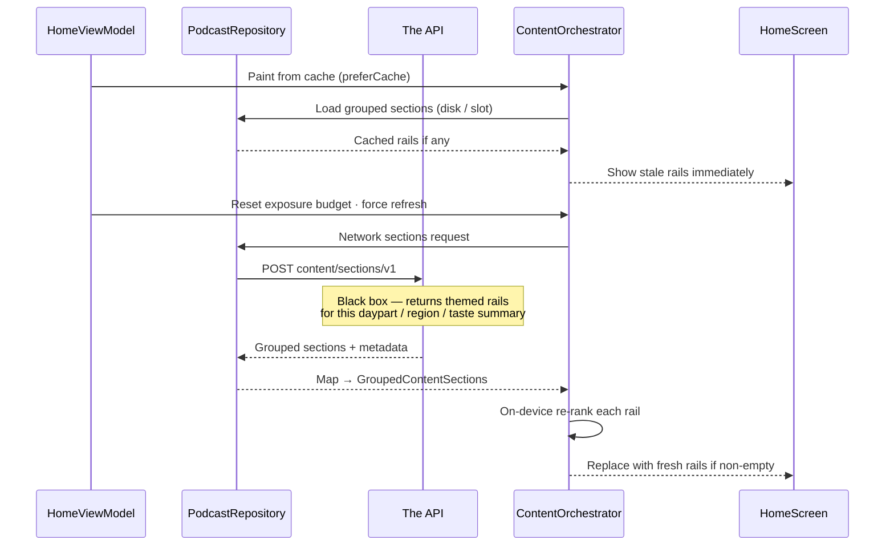

**Triggers (when Home refreshes rails)**  
Region, local daypart/date, subscription set, or a coarse history-maturity bucket — **not** every tiny history tick (that used to cancel in-flight loads).

**Home policy**  
`allowUngroupedFallback = false`: if the grouped sections path fails, Home keeps the previous good rails (or shows empty/skeleton) rather than inventing unrelated catalog rows.

### A4.3 What leaves the device (bounded only)

The sections request sends **summaries**, not your raw timeline or local model matrices:

| Sent (examples) | Not sent |
|-----------------|----------|
| Country, languages, local clock / daypart | Full listening history rows |
| Recent seed episode/show IDs with weights | Local bandit covariance matrices |
| Canonical genre affinities (bounded) | Raw “Podcast” placeholder genres |
| Duration preference, maturity, novelty | Unbounded personal dumps |
| Subscription / exclusion IDs | Encrypted backup contents |
| Recent section intent IDs (rotation) | |

### A4.4 How rails stay fresh without feeling slow

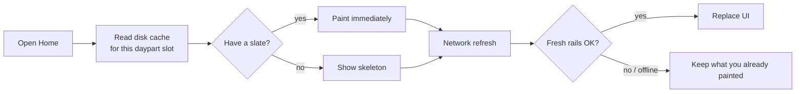

- **Exact cache key** = daypart slot + profile fingerprint (taste / seeds / prefs hash).
- **Stale-while-revalidate** can paint a prior slate for the same slot even if the fingerprint moved slightly, then refresh.
- One **active** payload is kept per daypart slot; superseded fingerprints are cleared so an old profile can’t resurrect forever.
- Client pins an expected **algorithm version** string (opaque version marker). Cache entries with a different version are dropped so a rolled-out recipe can’t poison the UI.

### A4.5 How learning feeds the next rails

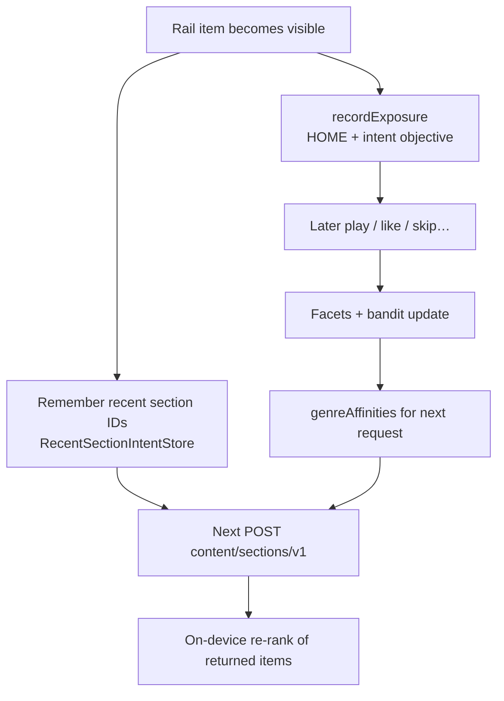

Visible rails call `trackAdaptiveSectionVisible` → exposures for learning, plus recent intent IDs so later dayparts can **rotate themes**.

---

## A5. Surfaces at a glance

| Surface | Feels like | Engine (client) | API (paths only) |
|---------|------------|-----------------|------------------|
| Home — discovery rails | Themed rows under greeting | `ContentOrchestrator` + grouped sections | `POST content/sections/v1`, `GET content/catalog/v1` |
| Home — Mixtape | Your listening queue strip | `MixtapeEngine` | `POST recommendations/v2` (fallback) |
| Home — Because you like | More like show X | Home UI | `POST recommendations/because-you-like` |
| Home — Discover | Charts / trending masonry | `HomeViewModel` filters | `GET trending` / bootstrap |
| Explore — For You | Broader discovery list | Explore + adaptive score | `POST recommendations/v2` |
| Explore — search | Natural-language find | Explore + light re-rank | `GET search/semantic` |
| Learn | Curiosity cards | `LearnViewModel` | `GET curated/curiosity-v3` |
| Smart Queue / Auto | Keep listening | `SmartQueueEngine` | `recommendations/v2`, `episodes/similar`, `trending` |
| Downloads | Offline picks | Smart download + `OFFLINE` objective | `recommendations/v2` |

---

# Part B — Engineer deep-dive (on-device)

## B1. Architecture at a glance

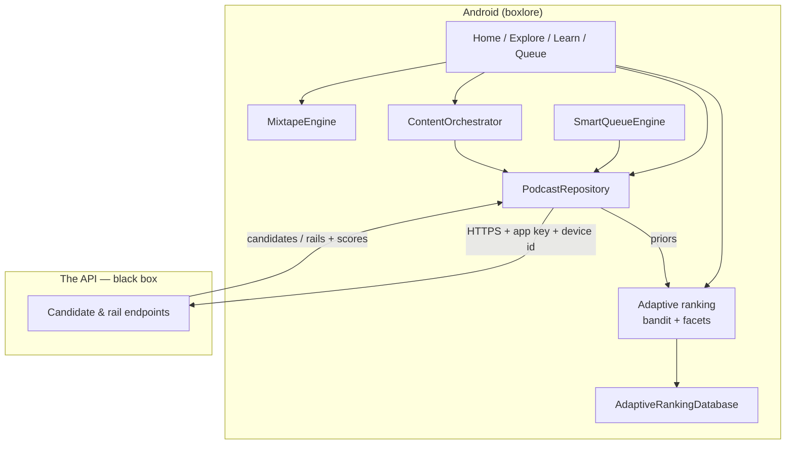

Key packages:

- `core/ranking/.../ranking/` — bandit, facets, reward, features, persistence (extracted to `:core:ranking` in Phase A5; same Kotlin package `cx.aswin.boxlore.core.data.ranking`).
- `core/data/.../content/` — Home retrieval → ranking → layout (including grouped sections).
- `core/data/MixtapeEngine.kt`, `core/data/SmartQueueEngine.kt` — surface engines.
- `core/network/.../BoxLoreApi.kt` — Retrofit boundary.

---

## B2. The learned model — `AdaptiveLinearModel`

File: `core/ranking/.../ranking/AdaptiveLinearModel.kt`

Per-objective **regularized online linear model** with optional UCB exploration (LinUCB-style).

### B2.1 State (`AdaptiveModelState`)

| Field | Meaning |
|-------|---------|
| `covariance` (`A`) | `d×d`, init `RIDGE · I` (ridge = `1.0`). Accumulates `Σ xxᵀ`. |
| `inverseCovariance` (`A⁻¹`) | Cached inverse, Gauss-Jordan each update. |
| `rewardVector` (`b`) | `Σ x · reward`. |
| `updateCount` | Resolved outcomes. |
| `featureSchemaVersion` / `dimension` | Schema guard (`dimension = 18`). |

Learned weights: **`θ = A⁻¹ · b`**.

### B2.2 Scoring

```
rawLearned  = θ · x
learned     = tanh(rawLearned)
uncertainty = α · sqrt(xᵀ A⁻¹ x)          // α = 0.15
blend       = min(updateCount/50, 1) · 0.65
final       = clamp( (1-blend)·prior + blend·learned + uncertainty , -1, 1)
```

- Prior always keeps ≥35% weight at full blend.
- UCB only when the objective `allowsExploration` **and** `updateCount ≥ 50`.

### B2.3 Learning (`update`)

```
A ← forgetting·A  +  (1-forgetting)·RIDGE·I(diagonal)  +  x·xᵀ
b ← forgetting·b  +  x·reward
A⁻¹ ← invert(A)
updateCount += 1
```

`forgettingFactor = 0.995` — tastes can drift; ridge keeps `A` invertible.

Tests: `AdaptiveRankingTest` (cold start blend, offline never explores, opposite outcomes).

---

## B3. Taste model — `BayesianPreferenceFacet`

File: `core/ranking/.../ranking/BayesianPreferenceFacet.kt`

Facet types: `SHOW`, `GENRE`, `SOURCE`, `DURATION_BUCKET`, `TIME_CONTEXT`, `INTENT`.

- Positive/negative evidence from rewards; **90-day half-life** decay.
- Affinity in `[-1, 1]` with symmetric Beta-style prior.
- Genre keys are **canonicalized** (`PodcastGenres`); placeholder `"Podcast"` is ignored.
- Migration (`pruneNonCanonicalGenreFacets`) **merges** alias evidence into canonical keys before deleting aliases.

Facets are features for the bandit **and** bounded genre affinities for `content/sections/v1`.

---

## B4. Feature vector (18 dimensions)

`CandidateFeatureBuilder` / `FeatureSlot` — includes (among others) retrieval prior, freshness, duration fit, subscription/history flags, show/genre/source affinities, time context, novelty. Schema versioned; dimension mismatches refuse to load stale matrices.

---

## B5. Reward model

`RankingReward` maps actions + listen fraction into `[-1, 1]`.

| Family | Examples |
|--------|----------|
| Strong positive | Complete, like, subscribe, explicit queue, manual download |
| Mild positive | Meaningful play, open details |
| Negative | Early skip, dismiss, remove autofilled, unlike / unsubscribe |

**Meaningful play:** ≥ 60s **or** ≥ 20% of duration. Playback service dedups rapid repeat actions (~5s).

---

## B6. Learning loop end-to-end

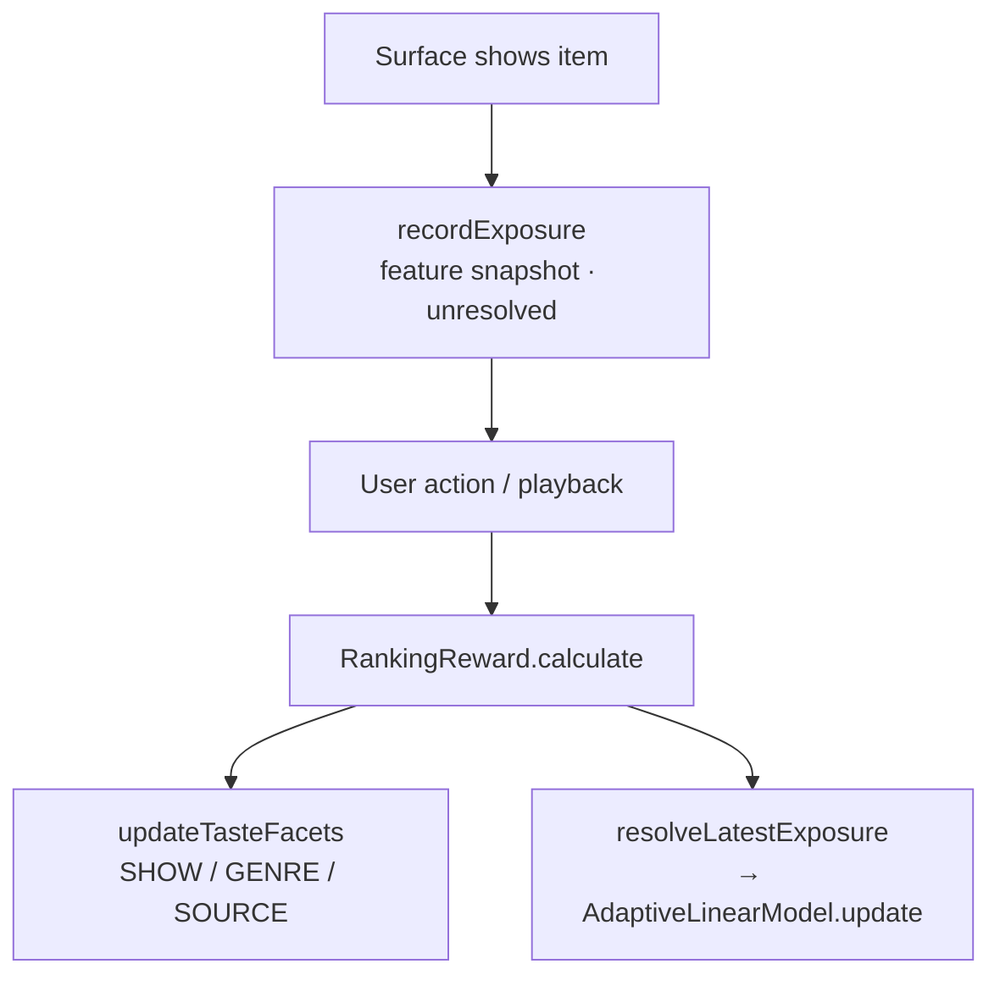

If there was no exposure (e.g. deep link), **facets still update** so taste isn’t lost.

| Signal | Typical emitter |
|--------|-----------------|
| Queue / reorder / remove autofill | `PlaybackRepository`, `QueueRepository` |
| Like / subscribe / download | Playback / subscription / download repos |
| Play / complete / early skip | `BoxLorePlaybackService` |
| Lore open / dismiss | `LearnViewModel` |
| Home rail visibility | `HomeViewModel.trackAdaptiveSectionVisible` |

---

## B7. Retrieval → ranking → diversification → layout

### B7.1 Candidate sources

`SUBSCRIPTION`, `LOCAL_HISTORY`, `SERVER_RECOMMENDATION`, `CURATED_INTENT`, `TRENDING`, `LIKED`, `DOWNLOADED`.

### B7.2 Scoring

`AdaptiveCandidateScorer` builds features, `scoreBatch`es the bandit, normalizes heavy-tailed API priors with log1p. If adaptive ranking is gated off for a surface, falls back to prior / `PodcastScoring`.

### B7.3 Diversification

`DiversityReranker`: de-dupe episodes, `maxPerShow`, genre/recent-show penalties, optional **novel slot**.

### B7.4 Home — `ContentOrchestrator` (grouped-first)

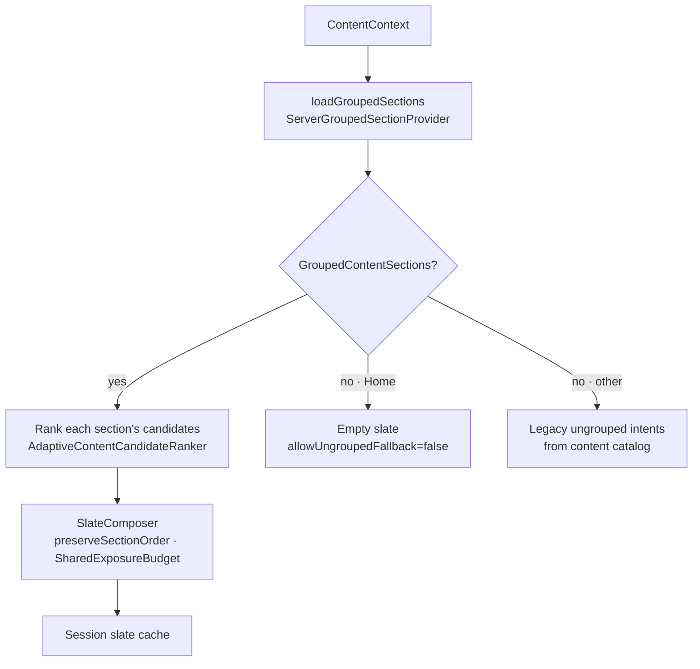

1. Prefer **grouped** rails from `POST content/sections/v1` (via `PodcastRepository.getPersonalizedContentSections`).
2. Rank items inside each rail on-device; compose with `preserveSectionOrder = true`.
3. `SharedExposureBudget` prevents the same episode/show dominating every rail.
4. Home paint path: cache → **reset exposure budget** → force refresh (so refresh isn’t filtered empty by the stale paint’s exposures).
5. Catalog (`GET content/catalog/v1`) still supplies intent metadata / fallbacks for surfaces that allow ungrouped composition.

---

## B8. Objectives, surfaces, controls

| Objective | Exploration | Typical use |
|-----------|-------------|-------------|
| `DISCOVERY` | yes (after threshold) | Home rails, Explore, Lore |
| `CONTINUATION` | limited | Mixtape, Smart Queue |
| `YOUR_SHOWS` | no | Subscription ranking |
| `OFFLINE` | no | Downloads |

`RankingRuntimeControls` can disable adaptive re-ranking per (objective, surface) without breaking priors.

---

## B9. Persistence, backup, pruning

- Room DB: models, facets, exposures.
- Exposures: retention + row cap (aggressive prune).
- Opt-in encrypted backup includes adaptive ranking state.
- Reset / “forget me” clears local ranking tables.

Debug inspector (local only): `learnerInspectorSnapshot()` — facets, exposures, feature weights; assembled off the main thread.

---

# Part C — API contract (black box)

The API is documented **by path and payload shape only**. How it retrieves or ranks internally is intentionally omitted.

## C1. Endpoints the client uses

| Path | Role |
|------|------|
| `POST /content/sections/v1` | **Home personalized discovery rails** (primary) |
| `GET /content/catalog/v1` | Intent / catalog metadata for Home composition |
| `POST /recommendations/v2` | Preferred seed-based candidate lists |
| `POST /recommendations` | Legacy v1 fallback (fuller history payload) |
| `POST /recommendations/because-you-like` | Home “Because you like” |
| `POST /episodes/similar` | Queue / episode-info neighbors |
| `POST` / `GET /home/bootstrap` | Cold-start briefing + trending (+ optional recs) |
| `GET /curated/vibe` | Curated vibe lists (secondary / legacy daypart uses) |
| `GET /curated/curiosity-v3` | Learn / Lore deck |
| `GET /search/semantic` | Explore natural-language search |
| `GET /trending` | Charts / Discover / queue tiers |

**Auth (client view):** app key on requests; optional App Check JWT when enforced; device UUID scopes per-device caches; app version for analytics slicing.

## C2. Home sections — `POST /content/sections/v1`

**Request (high level):** surface (`home`), local date / timezone offset / minute-of-day, country, languages, recent seeds, interests, subscribed / excluded IDs, taste signal summaries, duration preference, history maturity, novelty preference, recent section IDs, candidate budget, contract version.

**Response (high level):** `contractVersion`, `catalogVersion`, `resolvedDaypart`, `algorithmVersion`, `isFallback`, `sections[]` each with intent metadata + candidate items (scores/metadata for client priors).

**Client duties after response**

1. Reject / drop disk cache if `algorithmVersion` ≠ expected pin.
2. Map → `GroupedContentSections`.
3. Re-rank with `DISCOVERY` / intent objective.
4. Persist one active cache entry per daypart slot (+ latest pointer).

## C3. Recommendations v2 vs legacy v1

| | Legacy `POST /recommendations` | Current `POST /recommendations/v2` |
|--|--------------------------------|-------------------------------------|
| Input | Heavier history-oriented payload | Bounded **seeds** + exclusions + mode |
| Client learning | None in the old standalone path | Designed to feed on-device ranking |
| Failure mode | — | Client may fall back to v1, then local heuristics |

**Why v2 + on-device ranking wins for listeners**

- Less raw history leaves the device.
- Explicit exclusions (queued / seen) at request time.
- Richer candidate metadata for priors.
- Contract versioning (`contractVersion`, `mode`) for forward compatibility.
- Phone still owns personalization — API candidates are not the final order.

Legacy engagement-weight / cluster details from older write-ups are superseded; treat v1 as **compatibility fallback** only.

## C4. Bootstrap, vibes, curiosity, because-you-like

- **Bootstrap** — packs briefing + trending (+ recs) for first paint.
- **Curated vibe** — named vibe lists; Home discovery now prefers **sections/v1** rails over vibe rows.
- **Curiosity v3** — Lore cards; client filters dismissals and records exposures.
- **Because-you-like / similar** — show- or episode-seeded neighbor lists for UI modules and queue tiers.

## C5. Caching (what the client relies on)

| Layer | Role |
|-------|------|
| API response caching | Opaque to the client; honor normal HTTP / bypass headers when debugging |
| Client memory | Short-TTL maps for recs / because-you-like |
| Client disk | Home sections slot cache, content catalog ETag cache, session prefs |
| Orchestrator session | In-memory `ContentSlate` keyed by context + refresh policy |

Bypass for debugging: `Cache-Control: no-cache` or `?bypass_cache=true` where supported.

## C6. Privacy boundary checklist

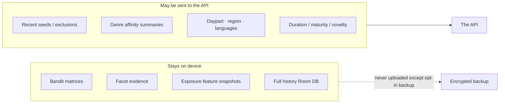

---

# Part D — Scenarios, diagnostics, reference

## D1. Technical scenarios

### A — Cold start (day 1)

No history → sections/bootstrap lean on region charts + curated themes → `isFallback` may be true → bandit blend ≈ 0 → user sees broad discovery; facets start filling after first plays.

### B — Warm Home (many outcomes, clear genre taste)

Cached rails paint instantly → refresh sends genre affinities + recent section IDs → API returns themed rails → on-device re-rank lifts familiar-good shows while diversity caps repeats → Discover omits those show IDs.

### C — Smart Queue after a discovery land

Queue asks v2 with exclusions → continuation objective ranks refill → skip memory down-ranks repeatedly skipped shows.

### D — Repeated early skips on one show

Negative rewards + SHOW facet drop → future Home/Queue priors and learned scores suppress that show.

### E — Explore semantic search

API returns relevance-ordered hits → client lightly re-ranks inside tie windows with `DISCOVERY`.

### F — Lore card swipe

Exposure on show → dismiss/play resolves → genre/show facets move → later Home rails and Explore feel the shift.

### G — Backup & restore

New device restores encrypted adaptive DB → learning stage continues instead of cold start.

### H — Network failure on sections refresh

Keep painted cache; offline prefer-cache path returns disk slate; empty network must not clear a good UI.

---

## D2. Learning lifecycle (stages)

| Stage | Rough signal | UX feel |
|-------|--------------|---------|
| Cold start | ~0 outcomes | Charts, curated themes, API priors |
| Learning | Growing `updateCount` | Blend rises; facets sharpen |
| Adaptive | ≥ ~50 outcomes on an objective | Exploration eligible where allowed; stronger personal ranking |

Telemetry buckets (`cold_start` / `learning` / `adaptive`) are derived similarly for analytics.

---

## D3. Diagnostics & safety

- Debug screen: Adaptive Learner inspector (local snapshot only).
- Runtime flags can disable adaptive re-rank per surface.
- Schema / algorithm version mismatches refuse bad cache or model rows.
- Provider failures in orchestrator are isolated; Home grouped path fails closed (empty) rather than wrong rails.

---

## D4. Type / file quick reference

| Concern | Types / files |
|---------|----------------|
| Bandit | `AdaptiveLinearModel`, `AdaptiveRankingRepository` |
| Facets | `BayesianPreferenceFacet`, `PodcastGenres` |
| Rewards | `RankingReward`, `RankingFeedbackRepository` |
| Home slate | `ContentOrchestrator`, `SlateComposer`, `GroupedContentSectionProvider` |
| Sections cache | `ContentSectionsCachePolicy`, `PodcastRepository` persist/read helpers |
| Rotation | `RecentSectionIntentStore` |
| Home UI | `HomeViewModel`, `HomeScreen`, section headers / skeletons |
| Mixtape / Queue | `MixtapeEngine`, `SmartQueueEngine` |
| API boundary | `BoxLoreApi`, `ContentSectionsV1Request` / `Response` |

---

## D5. Worked example — morning Home (client)

1. Daypart → “Good Morning” greeting; rails subtitle omitted.
2. Cache paint shows yesterday-afternoon-slot? No — slot is morning; may skeleton or prior morning slate.
3. `POST content/sections/v1` with maturity bucket, genre affinities, recent section IDs.
4. Response: 2–3 rails, `algorithmVersion` matches pin.
5. Each rail re-ranked with `DISCOVERY`; exposure budget shared across rails.
6. User plays item #2 on rail 1 → exposure resolves → facets + bandit update.
7. Discover grid excludes podcast IDs already on rails/hero.

---

## D6. Mental model (one diagram)

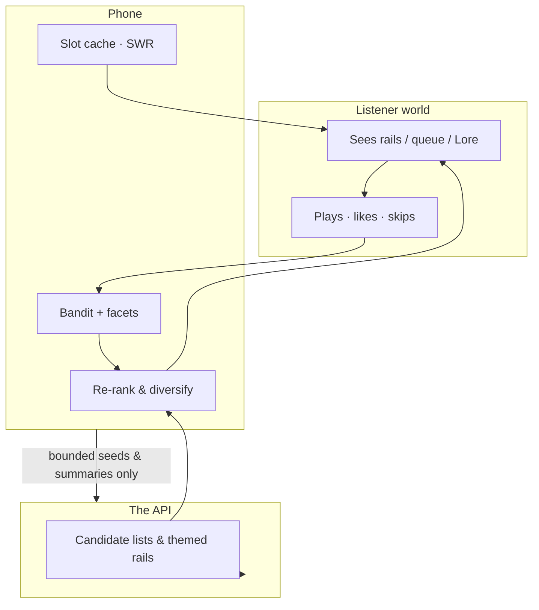

---

*Documentation only. Implementation details of API retrieval infrastructure are deliberately excluded; when in doubt, trust the Android client contracts in `core/network` and the ranking/content packages above.*
